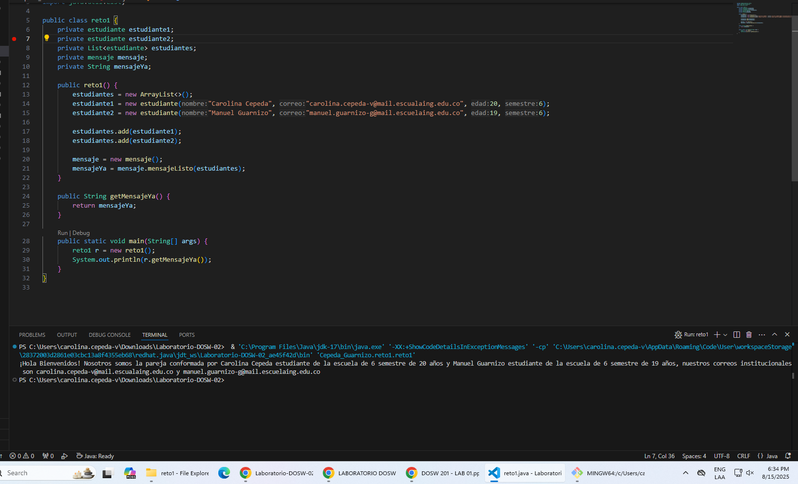
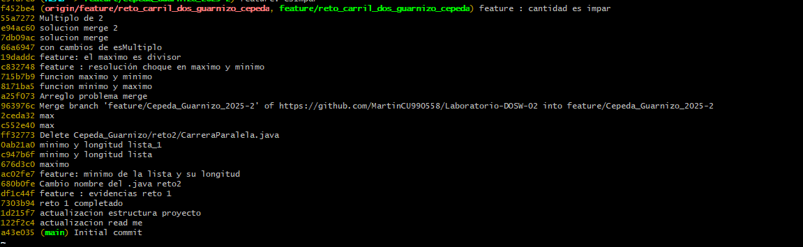
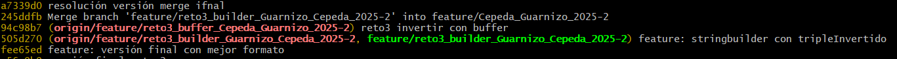
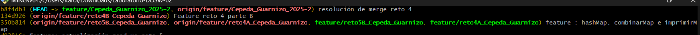
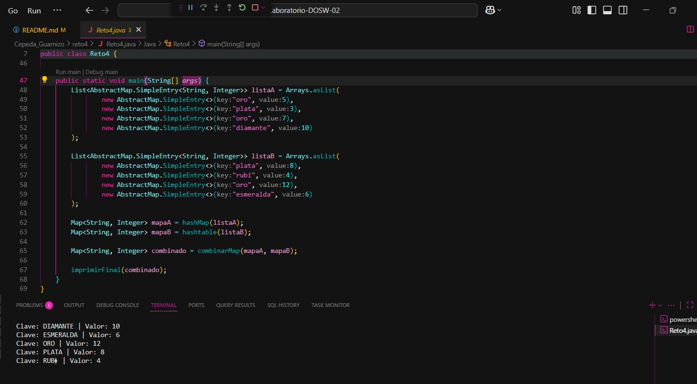
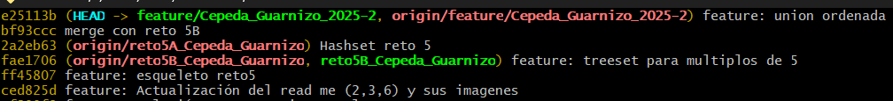
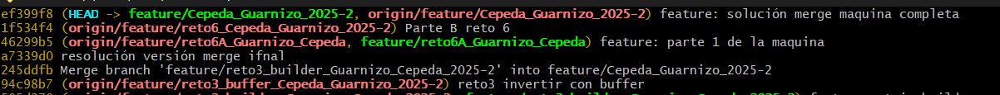
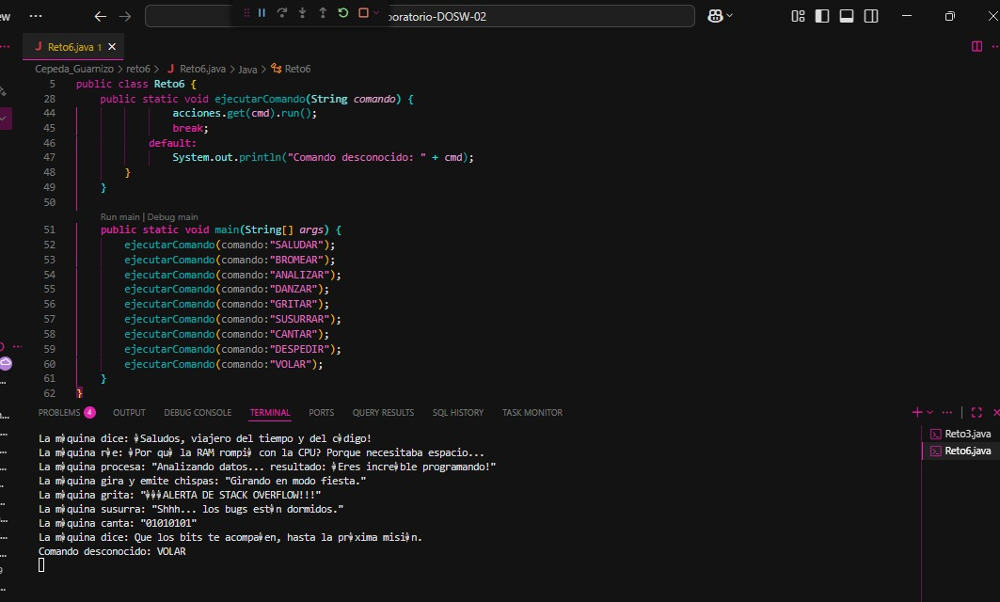

# Laboratorio-DOSW-02
# Maratón Git 2025-2

**Integrantes:**
- Carolina Cepeda Valencia
- Manuel Alejandro Guarnizo

**Nombre de la rama:** feature/Cepeda_Guarnizo_2025-2
---
## Retos Completados

### Reto 1 : Mensaje de Bienvenida!

**Evidencia**

Hicimos una clase estudiante, metimos cada uno en una lista y manejamos el uso Map en la clase mensaje
para que este recolectara la información de cada uno.

### Reto 2: Carrera en Paralelo
**Evidencia**

Hicimos dos ramas , en las cuales manejamos el uso de diferentes funciones y streams, encontrando
el maximo y minimo de la lista, si el numero mayor era multiplo o divisor de 2, etc.
A la hora de resolver el merge, añadimos las funcionalidades a la rama principal, y resolvimos los conflictos
de manera manual, ya que se trataba de dos funciones diferentes que hacían lo mismo.

### Reto 3: El eco misterioso
**Evidencia**

Manejamos el uso de String builder y StringBuffer, para manejar el eco de la frase que se le pasaba por consola.
A la hora de resolver el merge, se trataba de dos funciones diferentes que hacían lo mismo, por lo que se resolvió de manera manual, añadiendo las funcionalidades a la rama principal.

### Reto 4: El tesoro de las llaves duplicadas
**Evidencia**

Se hace el uso de HashMap ignorando claves duplicadas, y se hace uso de hashTable para mostrar el funcionamiento de metodos similares
con diferentes colecciones.A la hora de resolver el merge, se hace la inclusión de las funcionalidades de ambas ramas,priorizando los
valores de hashtable en caso de conflicto.

Hacemos uso de una función main para mostrar el funcionamiento de la clase.
### Reto 5 :Batalla de conjuntos
**Evidencia**

Manejamos el uso de conjuntos, y a la hora de resolver el merge, se trataba de dos funciones diferentes que hacían practicamente lo mismo, por lo que se resolvió de manera manual, añadiendo las funcionalidades a la rama principal.
### Reto 6: La maquina de decisiones
**Evidencia**

Manejamos el uso de la interfaz run para manejar ka ejecución de cada acción, a la hora de resolver el merge conflict decidimos manejarlo con un mapa para que se maneje como un menu de todas las acciones que se pueden realizar, y cada una de estas acciones se ejecuta dependiendo de la opción que elija el usuario.
