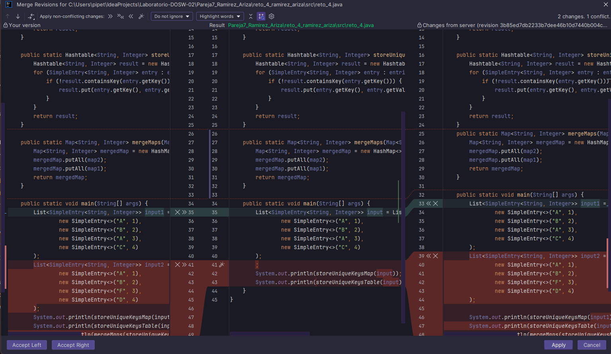
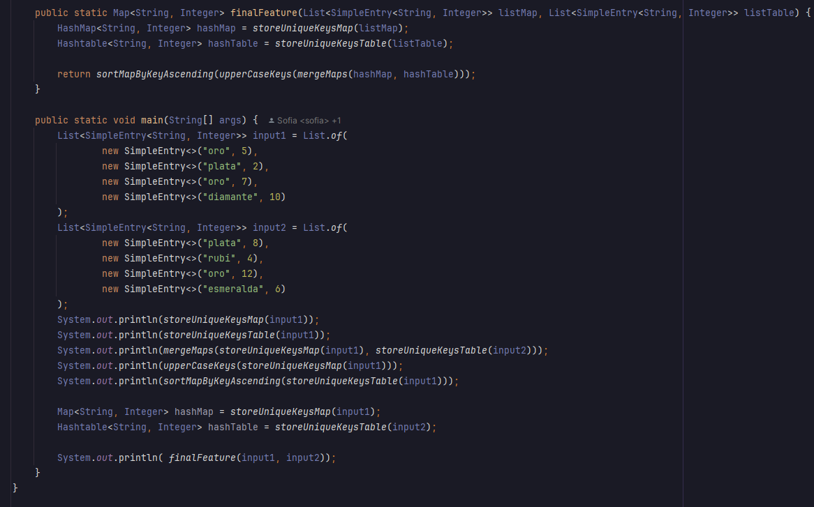

# Laboratorio-DOSW-02

# Maratón Git 2025-2

** Integrantes :**
-  Sofia Nicolle Ariza Goenaga
-  Tomas Felipe Ramirez Alvarez

** Nombre de la rama :** feature/RamirezTomas_ArizaSofia_2025-2

## Retos Completados

### Reto 1: Configuración y creación de rama
** Evidencia :**

Hicimos un desarrollo de clases de las estudiantes y la clase que imprime el mensaje el cual es redactado lógicamente
atravez de mensajes y organizar la información para imprimirlo correctamente dando una solución óptima para la clase

Lo que se planeo hacer fue una "plantilla" que convirtiera la información de los estudiantes en un mensaje segun 
la redaccion solicitada por el problea. Conviertiendo los objetos de la lista es un flujo del que pudieramos 
extraer de manera relativamente eficiente los atributos especificos.

### Reto 2: Commit colaborativo
** Evidencia :**

En este reto nos dismos a la intervencion rigurosa de cada una de las reglas para hacer su desarrollo
lo mas claro,consiso y limpio al momento de detallar tanto visual como logicamente el codigo presentado 
el cual atravez de clases y metodos se desarrollo el ejercicio del punto 2 de manera correcta, se evidencian
en los pantallasos los procesos para llegar a su etapa final.

En la siguiente se puede apreciar como se evidencian los choques propuestos en el ejercicio 

Después de las rigurosas pruevas y creacion de una nueva clase solicitada para el resultado final asi se 
aprecia su trabajo en totalidad de los requerimientos solicitados
Con el fin de dar solucion a cada una de las incopnitas propuestas en este reto la ultima pregunta es alucion
a usar el comando "git log --oneline"

### Reto 3: El eco misterioso
** Evidencia :**
Cada uno de los miembros del equipo creo su propia rama y creo los metodos correspondientes al primer punto.
Para repetir el mensaje recibido, se creo una funcion que devolvia una funcion lambda compuesta de la siguiente manera.
Stream para generar un ciclo que se repitiera tres veces. Por cada iteracion se agregaria el mensaje en el stringBuilder, 
sin embargo, se agrego una verificacion para saber cuando era necesario añadir o no añadir un espacio intermedio.

Para el reverse fue mucho más sencillo y solo se utilizó la funcion reverse de la clase buffer.

Cada uno mergeo cada rama individual en la principal del reto, y se solucionaron los conflictos para llegar al resultado 
final en el que se utilizaban las funciones anteriores en pro del último paso.

### Reto 4: El misterio de las llaves misteriosas 
Cada estudiante crea su propia rama y comienza a resolver el problema correspondiente a su carril. Para el estudiante A
se creó un bucle que transformara la lista ingresada en un map con ayuda de la funcion ifAbsent para determinar cuando
agregar o no agregar y evitar duplicados

en el segundo camino tambien se utilizo un bucle, pero acompañado de una verficacion if para revisar la condicion de 
duplicados

Se mezclaron las ramas en la feature del reto y se solucionaron los conflictos del merge. Al igual que con la funcion para
combinar los mapas, en la cual solo se utilizaron las funciones propias de los maps putAll. Solo hacia falta cambiar el 
orden en el que se agregaban los datos para que el resultado final fuera el esperado.

Para crear la función de las claves en mayusculas se tuvo que crear un nuevo mapa, pues no se dejaba editar el mapa original,
utilizando la función stream se recorrió el mapa y fue agregando clave en mayuscula con su valor original hasta comopletar
el mapa original con las claves en upperCase.

de manera similar, se utilizó el stream para convertir el mapa en un flujo, se ordeno las claves y se agregaron a un 
nuevo mapa, verificando las repeticiones, para que el resultado final fuera el esperado.

Finalmente se utilizaron todas las funciones anteriores en orden para convertir las listas en maps, combinarlos, luego 
ordenarlos y convertir las claves a mayusculas siempre teniendo en cuenta que el hashTable tenia prioridad sobre los datos.

___

### Reto 5: Batalla de conjuntos
Cada miembro del equipo creo su rama apartir de la rama principal del reto. Y se hicieron dos funciones muy parecidas para
resolver el problema propuesto. Se creó un hashSet para evitar duplicados y se utilizó una funcion lambda para remover los
multiplos de tres o de cinco según corresponda para cada usuario. 

Al momento de mergear no hubo muchos problemas y el merge logro solucionarlo automaticamente solo dejando un cambio sobre 
el otro. Dado que eran conjuntos los elementos no se repetian y solo se uso la funcion addAll de los sets para agregar los
de un conjunto en el otro. 

### Reto 6: La maquina de desiciones
** Evidencia :**
Para empezar cada miembro del equipo en una rama separada creo el respectivo switch con cada parte de las instrucciones.

Luego se hicieron los merge a la rama feature del reto, y se resolvieron los conflictos.

al final, despues de resolver los conflictos obtuvimos.

Dada esta máquina de decisiones, nos propusimos cumplir con el segundo requirimiento, cambiando los llamados repetitivos,
por una estructura de for que guardaba en un map el nombre de la accion y su runnable. En el mismo ciclo quisimos llamar
los runnables para verificar que funcionaba de manera correcta sin añadir mas lineas de codigo. Se añadio una accion 
adicional fuera del bucle para terminar de verificar que todo funcionaba correctamente.

## Preguntas teóricas