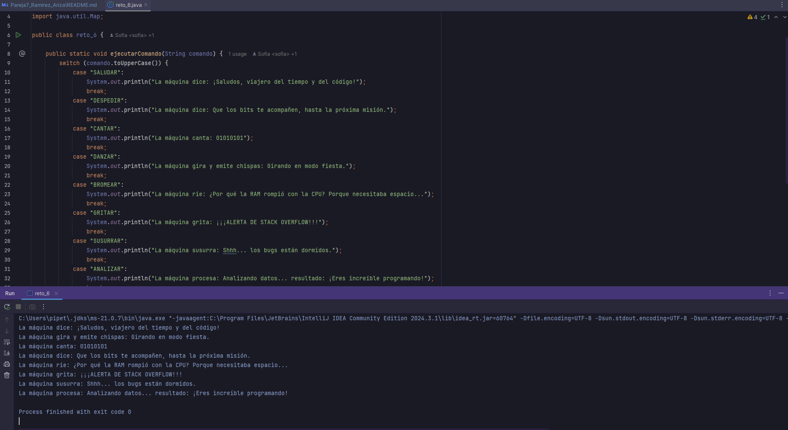

# Laboratorio-DOSW-02

# Maratón Git 2025-2

** Integrantes :**
-  Sofia Nicolle Ariza Goenaga
-  Tomas Felipe Ramirez Alvarez

** Nombre de la rama :** feature/RamirezTomas_ArizaSofia_2025-2

## Retos Completados

### Reto 1: Configuración y creación de rama
** Evidencia :**

Hicimos un desarrollo de clases de las estudiantes y la clase que imprime el mensaje el cual es redactado lógicamente
atravez de mensajes y organizar la información para imprimirlo correctamente dando una solución óptima para la clase

Lo que se planeo hacer fue una "plantilla" que convirtiera la información de los estudiantes en un mensaje segun 
la redaccion solicitada por el problea. Conviertiendo los objetos de la lista es un flujo del que pudieramos 
extraer de manera relativamente eficiente los atributos especificos.

### Reto 2: Commit colaborativo
** Evidencia :**

En este reto nos dismos a la intervencion rigurosa de cada una de las reglas para hacer su desarrollo
lo mas claro,consiso y limpio al momento de detallar tanto visual como logicamente el codigo presentado 
el cual atravez de clases y metodos se desarrollo el ejercicio del punto 2 de manera correcta, se evidencian
en los pantallasos los procesos para llegar a su etapa final.

En la siguiente se puede apreciar como se evidencian los choques propuestos en el ejercicio 

Después de las rigurosas pruevas y creacion de una nueva clase solicitada para el resultado final asi se 
aprecia su trabajo en totalidad de los requerimientos solicitados
Con el fin de dar solucion a cada una de las incopnitas propuestas en este reto la ultima pregunta es alucion
a usar el comando "git log --oneline"

### Reto 3: El eco misterioso
** Evidencia :**
Cada uno de los miembros del equipo creo su propia rama y creo los metodos correspondientes al primer punto.
Para repetir el mensaje recibido, se creo una funcion que devolvia una funcion lambda compuesta de la siguiente manera.
Stream para generar un ciclo que se repitiera tres veces. Por cada iteracion se agregaria el mensaje en el stringBuilder, 
sin embargo, se agrego una verificacion para saber cuando era necesario añadir o no añadir un espacio intermedio.

Para el reverse fue mucho más sencillo y solo se utilizó la funcion reverse de la clase buffer.

Cada uno mergeo cada rama individual en la principal del reto, y se solucionaron los conflictos para llegar al resultado 
final en el que se utilizaban las funciones anteriores en pro del último paso.

### Reto 6: La maquina de desiciones
** Evidencia :**
Para empezar cada miembro del equipo en una rama separada creo el respectivo switch con cada parte de las instrucciones.

Luego se hicieron los merge a la rama feature del reto, y se resolvieron los conflictos.

al final, despues de resolver los conflictos obtuvimos.

Dada esta máquina de decisiones, nos propusimos cumplir con el segundo requirimiento, cambiando los llamados repetitivos,
por una estructura de for que guardaba en un map el nombre de la accion y su runnable. En el mismo ciclo quisimos llamar
los runnables para verificar que funcionaba de manera correcta sin añadir mas lineas de codigo. Se añadio una accion 
adicional fuera del bucle para terminar de verificar que todo funcionaba correctamente.

## Preguntas teóricas