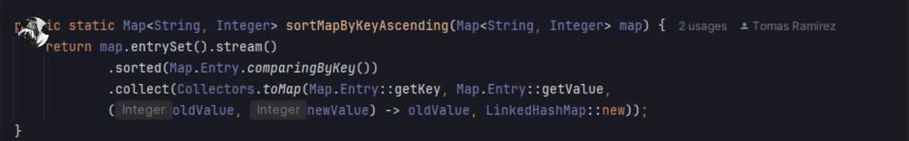
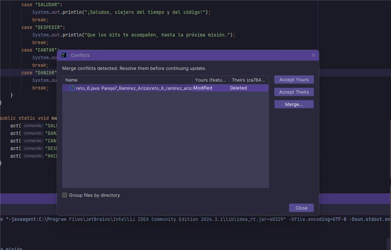
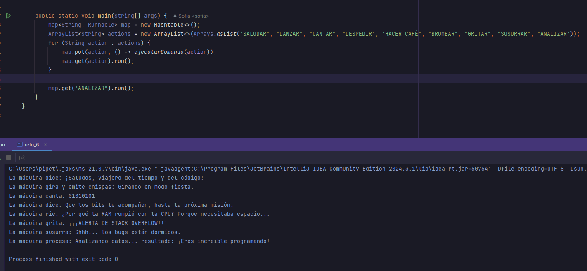

# 🚀 Laboratorio-DOSW-02
# 🏆 Maratón Git 2025-2

## 👥 Integrantes:
- **Sofia Nicolle Ariza Goenaga** ✨
- **Tomas Felipe Ramirez Alvarez** 💻

### Nombre de la rama :
 - feature/RamirezTomas_ArizaSofia_2025-2

## Retos Completados:

__________________________________________________________________________________________________
### Reto 1: Configuración y creación de rama
- Hicimos un desarrollo de clases de las estudiantes y la clase que imprime el mensaje el cual es redactado lógicamente
atravez de mensajes y organizar la información para imprimirlo correctamente dando una solución  óptima para la clase
- 
Lo que se planeo hacer fue una "plantilla" que convirtiera la información de los estudiantes en un mensaje segun 
la redaccion solicitada por el probleMa. Conviertiendo los  objetos de la  lista es un  flujo  del que pudieramos 
extraer de manera relativamente eficiente los atributos especificos.

__________________________________________________________________________________________________
### Reto 2: Commit colaborativo
- 
- En este reto nos dismos a la intervencion rigurosa de cada una de las reglas para hacer su desarrollo
lo mas claro,consiso y limpio al momento de detallar tanto visual como logicamente el codigo presentado 
el cual atravez de clases y metodos se desarrollo el ejercicio del punto 2 de manera correcta, se evidencian
en los pantallasos los procesos para llegar a su etapa final.

- 

- En la siguiente se puede apreciar como se evidencian los choques propuestos en el ejercicio 

- 

- Después de las rigurosas pruevas y creacion de una nueva clase solicitada para el resultado final asi se 
aprecia su trabajo en totalidad de los requerimientos solicitados
Con el fin de dar solucion a cada una de las incopnitas propuestas en este reto la ultima pregunta es alucion
a usar el comando "git log --oneline"

- 
__________________________________________________________________________________________________
### Reto 3: El eco misterioso
- Cada uno de los miembros del equipo creo su propia rama y creo los metodos correspondientes al primer punto.
Para repetir el mensaje recibido, se creo una funcion que devolvia una funcion lambda compuesta de la siguiente manera.
Stream para generar un ciclo que se repitiera tres veces. Por cada iteracion se agregaria el mensaje en el stringBuilder, 
sin embargo, se agrego una verificacion para saber cuando era necesario añadir o no añadir un espacio intermedio.

- 

- Para el reverse fue mucho más sencillo y solo se utilizó la funcion reverse de la clase buffer.

- 

- Cada uno mergeo cada rama individual en la principal del reto, y se solucionaron los conflictos para llegar al resultado 
 final en el que se utilizaban las funciones anteriores en pro del último paso.

- 
__________________________________________________________________________________________________
### Reto 4: El misterio de las llaves misteriosas 
- Cada estudiante crea su propia rama y comienza a resolver el problema correspondiente a su carril. Para el estudiante A
se creó un bucle que transformara la lista ingresada en un map con ayuda de la funcion ifAbsent para determinar cuando
agregar o no agregar y evitar duplicados

- 
- En el segundo camino tambien se utilizo un bucle, pero acompañado de una verficacion if para revisar la condicion de 
duplicados

-

- Se mezclaron las ramas en la feature del reto y se solucionaron los conflictos del merge. Al igual que con la funcion para
combinar los mapas, en la cual solo se utilizaron las funciones propias de los maps putAll. Solo hacia falta cambiar el 
orden en el que se agregaban los datos para que el resultado final fuera el esperado.
- 
- 
- 
- Para crear la función de las claves en mayusculas se tuvo que crear un nuevo mapa, pues no se dejaba editar el mapa original,
utilizando la función stream se recorrió el mapa y fue agregando clave en mayuscula con su valor original hasta comopletar
el mapa original con las claves en upperCase.
- 
- De manera similar, se utilizó el stream para convertir el mapa en un flujo, se ordeno las claves y se agregaron a un 
nuevo mapa, verificando las repeticiones, para que el resultado final fuera el esperado.

- 

- Finalmente se utilizaron todas las funciones anteriores en orden para convertir las listas en maps, combinarlos, luego 
ordenarlos y convertir las claves a mayusculas siempre teniendo en cuenta que el hashTable tenia prioridad sobre los datos.

- 
__________________________________________________________________________________________________

### Reto 5: Batalla de conjuntos
- Cada miembro del equipo creo su rama apartir de la rama principal del reto. Y se hicieron dos funciones muy parecidas para
resolver el problema propuesto. Se creó un hashSet para evitar duplicados y se utilizó una funcion lambda para remover los
multiplos de tres o de cinco según corresponda para cada usuario. 

- 

- Al momento de mergear no hubo muchos problemas y el merge logro solucionarlo automaticamente solo dejando un cambio sobre 
el otro. Dado que eran conjuntos los elementos no se repetian y solo se uso la funcion addAll de los sets para agregar los
de un conjunto en el otro. 
- 

__________________________________________________________________________________________________
### Reto 6: La maquina de desiciones

- Para empezar cada miembro del equipo crea una rama separada ala intelij respectivo switch con cada parte de las instrucciones.
- 
- 
- Luego se hicieron los merge a la rama feature del reto, y se resolvieron los conflictos.
- 
- 
- al final, despues de resolver los conflictos obtuvimos.
- 
- Dada esta máquina de decisiones, nos propusimos cumplir con el segundo requirimiento, cambiando los llamados repetitivos,
por una estructura de for que guardaba en un map el nombre de la accion y su runnable. En el mismo ciclo quisimos llamar
los runnables para verificar que funcionaba de manera correcta sin añadir mas lineas de codigo. Se añadio una accion 
adicional fuera del bucle para terminar de verificar que todo funcionaba correctamente.

- 

__________________________________________________________________________________________________
## Preguntas teóricas

1. **Cuál es la diferencia entre git merge y git rebase** 

### Git merge: 

- Combina dos ramas creando un nuevo commit de merge 

- Preserva el historial completo de ambas ramas 

- Es no destructivo en otras palabras no modifica commits ya existentes

**Git rebase:** 

- Reaplica los commits de una rama sobre la punta de otra 
- Crea un historial lineal sin commits de merge 

- Reescribe el historial puede ser destructivo si se fuerza push Git merge une ramas conservando 
todo el historial mediante un commit de fusión, por otro lado, git rebase modifica el historial transfiriendo 
los commits de una rama a otra para que sea lineal. 

2. **Si dos ramas modifican la misma línea de un archivo ¿Qué sucede al hacer merge?**
- Cuando dos ramas modifican la misma línea de un archivo, Git no puede resolver automáticamente porque el merge y genera 
un conflicto y se debe hacer de la siguiente manera 

   1. Resolver manualmente el conflicto editando el archivo 
   2. Marcar el conflicto como resuelto con git add 
   3. Completar el merge con git commit 
   3. ¿Cómo puedes ver gráficamente el historial de merges y ramas en consola? 

3. **¿Cómo puedes ver gráficamente el historial de merges y ramas en consola?**

   - (Ir a View → Tool Windows → Git )operando con el mouse 
   - (git log --oneline --graph --all –decorate) desde consola pero no se aprecia de una manera limpia

4. **Explica la diferencia entre un commit y un push? Git stash:**
   - Guarda temporalmente cambios no commitados 
   - Útil para cambiar de rama sin commitear Git pop: 
   - Aplica los cambios guardados con stash 
   - Elimina el stash aplicado de la lista

- Es como primero guardas el archivo en tu computadora (commit) y luego 
lo envías por email a tu equipo (push). 

5. **Para que sirve git stash y git pop?**
    ### Git stash: 
   - Guarda temporalmente cambios no commitados 
   - Limpia el working directory 
   - Útil para cambiar de rama sin commitear 
    ### Git pop: 
   - Aplica los cambios guardados con stash 
   - Elimina el stash aplicado de la lista 

Git stash guarda temporalmente tus cambios sin hacer commit, y git pop los recupera
cuando los necesites. Como poner pausa a un trabajo y luego continuar donde se dejo.

6. **Qué diferencia hay entre HashMap y HashTable? HashMap:**
- Permite una clave null y múltiples valores null 
- Mejor rendimiento en aplicaciones single-thread HashTable: 
- Es synchronized (thread-safe) 
- No permite claves ni valores null 

HashMap no es sincronizado mejor rendimiento en hilos individuales) y permite un null 
como clave, mientras que HashTable es sincronizado con varios hilos pero no permite nulls y tiene poco rendimiento.

7. **Qué ventajas tiene Collectors.toMap() frente a un bucle tradicional para llenar un mapa?**
   Más conciso y expresivo
   Menos propenso a errores
   Mejor legibilidad del código
   Funcional consiso y limpio
   Inmutabilidad
   es más conciso, expresivo, funcional y menos propenso a errores que un bucle tradicional, además de ofrecer mejor legibilidad del código.

8. Si usas List con objetos y luego aplicas stream().map() que tipo de operación estas haciendo?
   Es un proceso de transformación que se sitúa a medio camino. Toma cada ítem de la lista, utiliza una función (mapper) y produce un nuevo flujo con los ítems modificados.

9. Que hace el método stream().filter() y que retorna?
7. **¿Qué ventajas tiene Collectors.toMap() frente a un bucle tradicional para llenar un mapa?**

   Es más conciso, expresivo, funcional y menos propenso a errores que un bucle tradicional, además de ofrecer mejor legibilidad del código.
8. **¿Si usas List con objetos y luego aplicas stream().map() que tipo de operación estas haciendo?**

   Es un proceso de transformación que se sitúa a medio camino. Toma cada ítem de la lista, utiliza una función y produce un nuevo flujo con los ítems modificados.
9. **¿Qué hace el método stream().filter() y que retorna?**
   Filtra elementos del stream basado en una condición,retorna un nuevo stream(entrada/salida ) que contiene solo los elementos que cumplen la condición.
10. **Describe el paso a paso de cómo crear una rama desde develop si es una funcionalidad nueva.**

    Para crear una rama nueva desde consola se utiliza alguno de los comandos para crear ramas como git checkout branch -b, estando parados en la rama develop.
    En intellJ primero se va a la rama principal y se selecciona “new Branch from..” se reescribe el nombre y se le da a créate para crear la nueva rama como se uso en el laboratorio.
11. **¿Cuál es la diferencia entre crear una rama con git branch y con git checkout -b?**

    git branch solo crea la rama pero no cambia dentro de ella, mientras que git checkout -b crea la rama y inmediatamente te posiciona en ella.

12. **¿Por qué es recomendable crear ramas feature/ para nuevas funcionalidades en lugar de trabajar en main directamente?**
Es recomendable crear ramas feature/ para nuevas funcionalidades porque permite aislar los cambios, facilitando la 
revisión del código y manteniendo la rama principal más estable. Esto permite probar características de forma individual
y en caso de errores revertir cambios sin afectar el código principal. Además, facilita el trabajo en paralelo entre
equipos sin tantas interferencias.