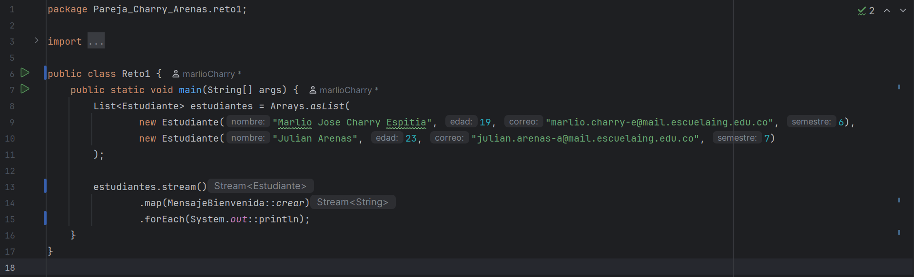
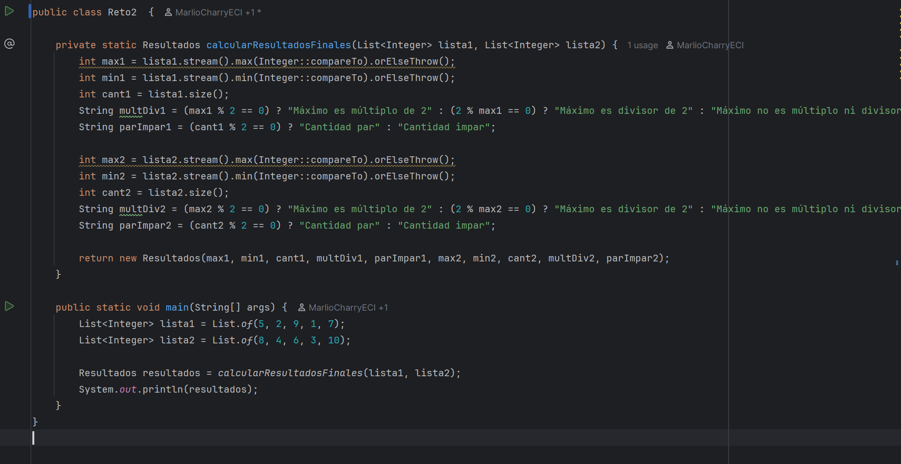
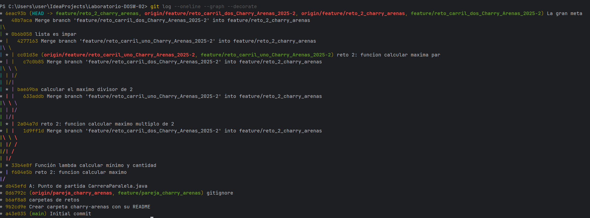
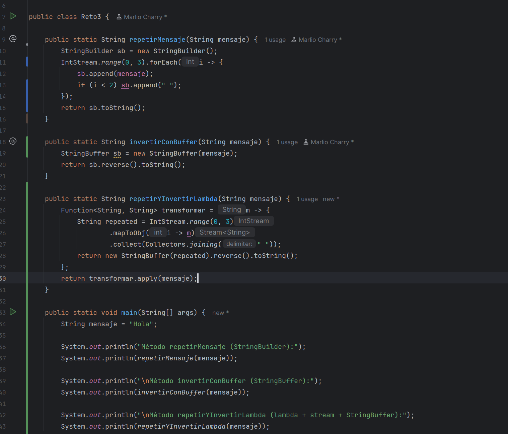
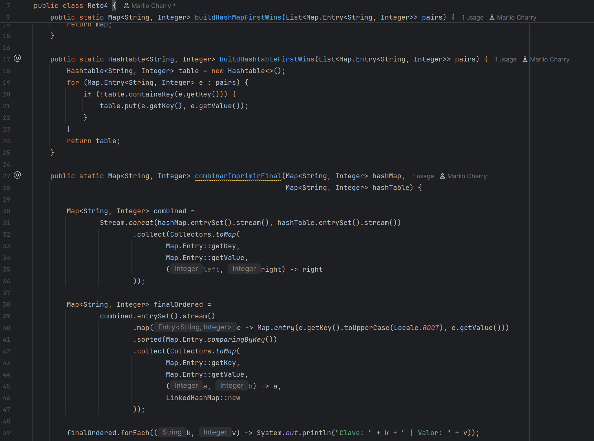
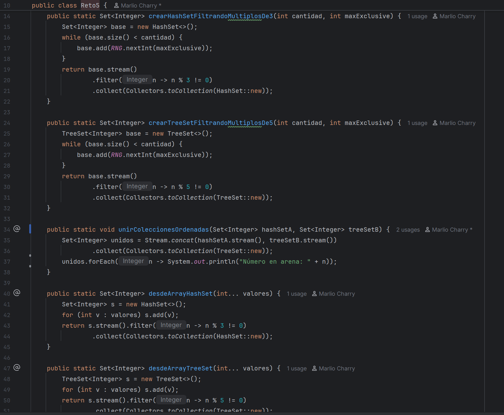
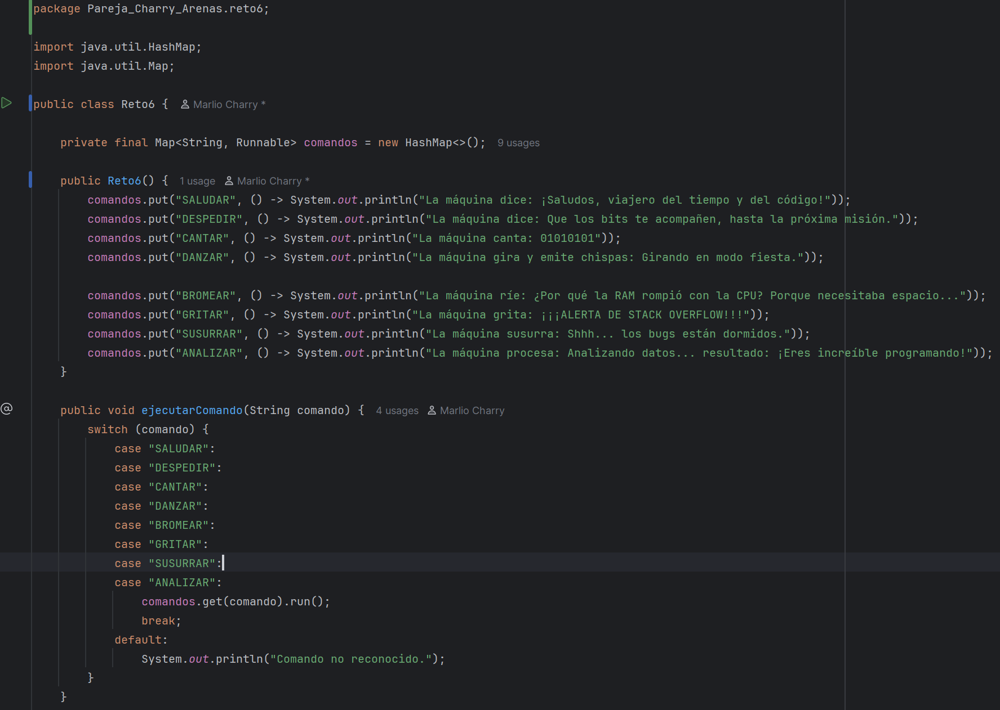

# Laboratorio-1-DOSW-02

# Maratón git 2025-2

**Integrantes:**

-Marlio Jose Charry Espitia

-Julian Eduardo Arenas Alfonso

---
## Retos completos

### Reto 1 Configuración y creación de la rama
**Evidencia:**

En este reto se creó un programa en Java que genera mensajes de bienvenida para estudiantes. Se definieron tres clases: Estudiante para almacenar los datos del estudiante, MensajeBienvenida para construir el mensaje de saludo, y Reto1 que contiene el main y ejecuta el programa mostrando los mensajes en consola.

### Reto 2 Carrera en paralelo
**Evidencia:**

El programa calcula para cada lista: el máximo, el mínimo, la cantidad de elementos, si el máximo es múltiplo o divisor de 2, y si la cantidad de elementos es par o impar. Los resultados se almacenan en la clase Resultados y se muestran en consola mediante el main de la clase Reto2. Esto se hizo poco a poco, creando una rama por estudiante, donde cada uno hacia una funcion, luego al mergearlas se solucionaban conflictos, haciendo un codigo que implemente ambos.

### Reto 3 El eco misterioso
**Evidencia:**

En este reto se repite un mensaje varias veces, se invierte usando StringBuffer y se combina repetición e inversión usando streams y lambda, mostrando los resultados en consola. Esto se logra haciendo los metodos en ramas separadas y mergeandolos en la principal.

### Reto 4 El tesoro de las llaves duplicadas
**Evidencia:**

En este reto se trabajó con mapas en Java, creando un HashMap y un Hashtable que almacenan claves y valores respetando el primer valor asociado a cada clave. Luego se combinan ambos mapas en uno solo, convirtiendo las claves a mayúsculas, ordenándolas alfabéticamente y mostrando los resultados en consola. De igual manera, haciendo las funciones por aparte y mergeandolas.

### Reto 5 Batalla de conjuntos
**Evidencia:**

En este reto se trabajó con colecciones en Java, creando HashSet y TreeSet que filtran números múltiplos de 3 y 5 respectivamente. Se generaron colecciones aleatorias y a partir de arrays, y luego se combinaron en una sola colección ordenada mostrando los números resultantes en consola. El merge obligó a hacer funciones extra para que ambos metodos funcionaran juntos.

### Reto 6 La máquina de decisiones
**Evidencia:**

En este reto se creó una máquina de comandos que ejecuta distintas acciones según la instrucción recibida. Se definieron comandos saludar, despedir, cantar, bailar, bromear, gritar, susurrar y analizar, cada uno asociado a un mensaje o acción que se muestra en consola cuando se ejecuta desde el método main. El merge obligó a que ambos metodos quedaran con un solo nombre y unificar los switch.

---

## Preguntas retóricas

#### 1.	Cuál es la diferencia entre git merge y git rebase
La diferencia entre git merge y git rebase es que merge combina dos ramas creando un commit de merge y preservando el historial, mientras que rebase mueve los commits de una rama sobre otra reescribiendo el historial y generando un historial lineal.
#### 2.	Si dos ramas modifican la misma línea de un archivo ¿Qué sucede al hacer merge?
Si dos ramas modifican la misma línea de un archivo, al hacer merge Git genera un conflicto que debe resolverse manualmente.
#### 3.	¿Cómo puedes ver gráficamente el historial de merges y ramas en consola?
Para ver gráficamente el historial de merges y ramas en consola se puede usar git log --oneline --graph --all --decorate, mostrando un árbol con commits, ramas y merges.
#### 4.	Explica la diferencia entre un commit y un push?
La diferencia entre commit y push es que commit guarda los cambios localmente en el repositorio y push envía los commits locales al repositorio remoto.
#### 5.	Para que sirve git stash y git pop?
git stash sirve para guardar temporalmente los cambios sin hacer commit y limpiar el working directory, y git pop aplica los cambios guardados en el stash eliminándolo de la lista de stashes.
#### 6.	Qué diferencia hay entre HashMap y HashTable?
La diferencia entre HashMap y Hashtable es que HashMap no es sincronizado y permite null como clave y valor, mientras que Hashtable es sincronizado y no permite claves ni valores null.
#### 7.	Qué ventajas tiene Collectors.toMap() frente a un bucle tradicional para llenar un mapa?
Las ventajas de Collectors.toMap() frente a un bucle tradicional son que permite construir mapas de forma más concisa y funcional, reduce código repetitivo y facilita la transformación de streams en mapas.
#### 8.	Si usas List con objetos y luego aplicas stream().map() que tipo de operación estas haciendo?
Al usar List con objetos y aplicar stream().map() se realiza una operación de transformación que genera un nuevo stream con los resultados de aplicar la función a cada elemento.
#### 9.	Que hace el método stream().filter() y que retorna?
El método stream().filter() selecciona elementos de un stream que cumplen una condición dada y retorna un nuevo stream con solo esos elementos.
#### 10.	 Describe el paso a paso de cómo crear una rama desde develop si es una funcionalidad nueva.
Para crear una rama desde develop para trabajar en una nueva funcionalidad, primero cambias a la rama develop y te aseguras de que esté actualizada con los cambios remotos. Luego, creas y cambias a la nueva rama con un nombre descriptivo, por ejemplo feature/nueva-funcionalidad. A partir de ahí, haces tus cambios, los vas confirmando con commits y finalmente envías la rama al repositorio remoto con un push.
#### 11.	¿Cuál es la diferencia entre crear una rama con git branch y con git checkout -b?
La diferencia entre crear una rama con git branch y con git checkout -b es que git branch solo crea la rama sin cambiar a ella, mientras que git checkout -b crea la rama y cambia automáticamente a ella.
#### 12.	¿Por qué es recomendable crear ramas feature/ para nuevas funcionalidades en lugar de trabajar en main directamente?
Es recomendable crear ramas feature/ para nuevas funcionalidades en lugar de trabajar en main directamente porque permite desarrollar aislado sin afectar código estable, facilita revisiones y testing, y mantiene el historial de main limpio y estable.