# Laboratorio-DOSW-02

**Integrantes:**
- Daniel Palacios
- David Salamanca

**Nombre de la rama:** feature/PalaciosDaniel_SalamancaDavid_2025-2

---

## Configuración Repositorio
**Evidencia:**
- Configuración Correo Eletrónico en Repositorio Local:
    
    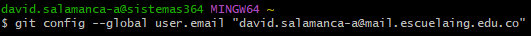

- Clonar el Repositorio

    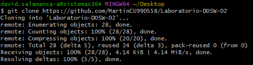

- Creacion de Rama de Principal

    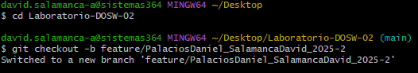

- Push

    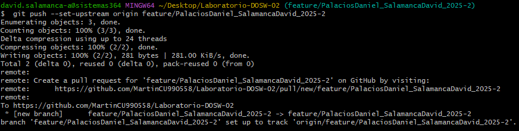

- Validación de la Estructura Creada

    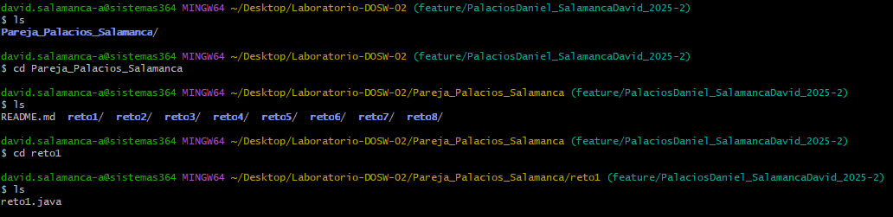

## Reto 1
**Evidencia:**

- Codigo Reto 1

    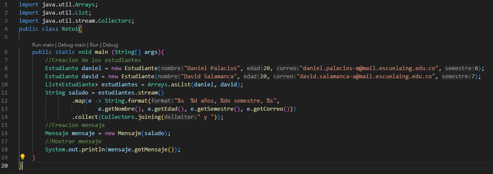

- Resultado Reto 1

    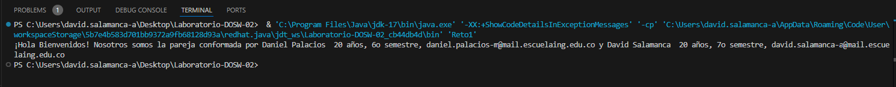

## Reto 2
**Evidencia:**

### Primer Choque

- Implementaciones iniciales para las ramas de cada estudiante

    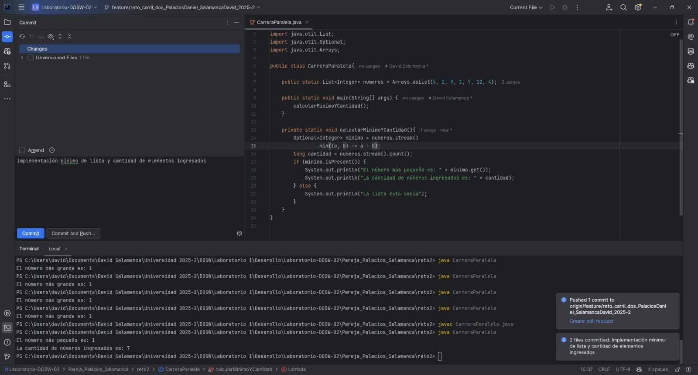

- Conflicto generado al momento de hacer merge

    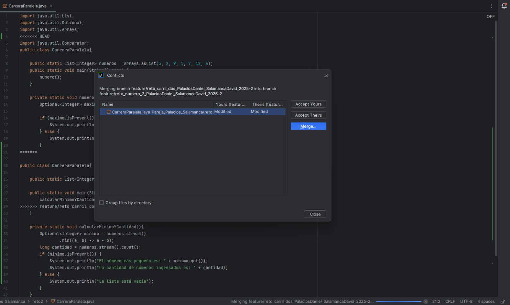

- Configuración de archivo resultante en el merge que genero conflictos para el primer choque

    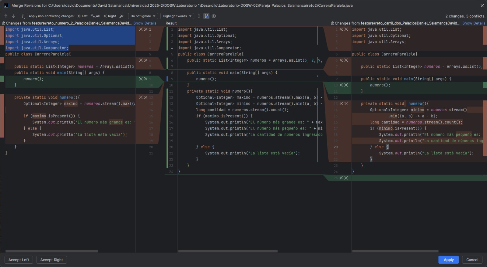

### Segundo Choque

- Implementaciones iniciales para las ramas de cada estudiante
    
    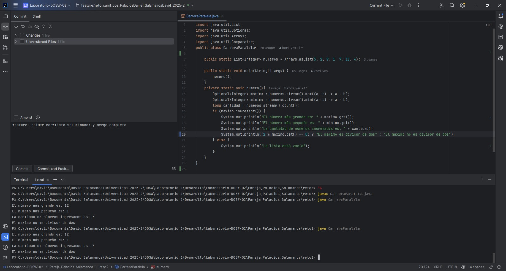

- Conflicto generado al momento de hacer merge

  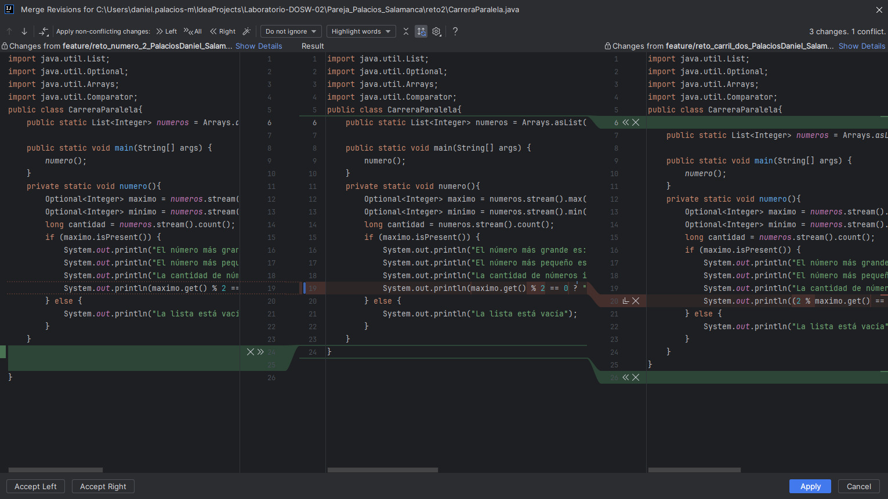

- Resultado Implementación

  

### Tercer Choque e Implementación Final

- Resultado Implementación Final - Junto al Log

  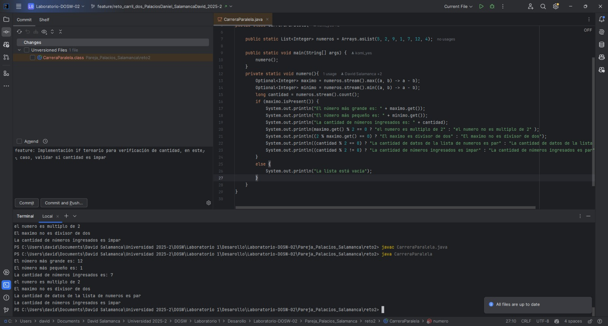

  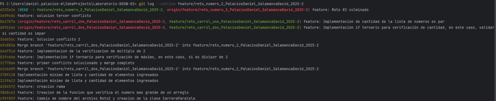

## Reto 3
**Evidencia:**

- Implementación Inicial

  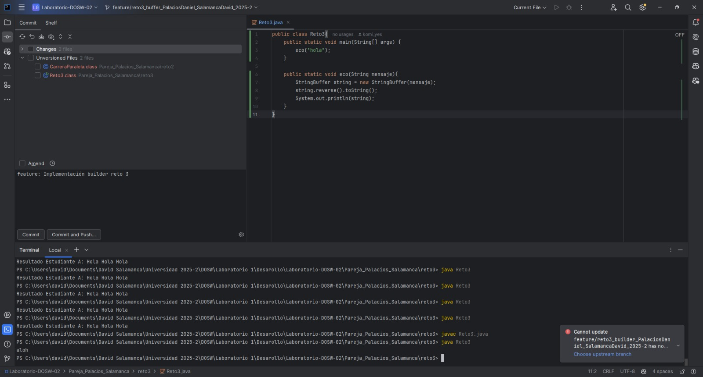

- Resultado implementación después de solucionar conflictos de merge

  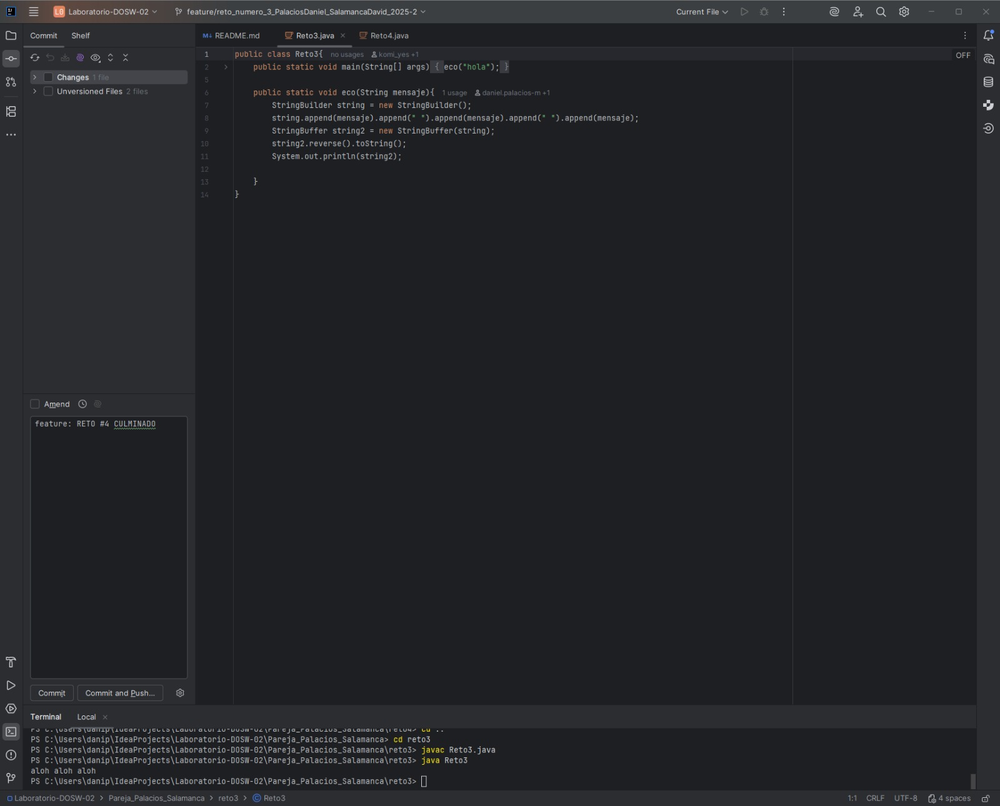

## Reto 4
**Evidencia:**

- Implementación inicial en sus ramas correspondientes

  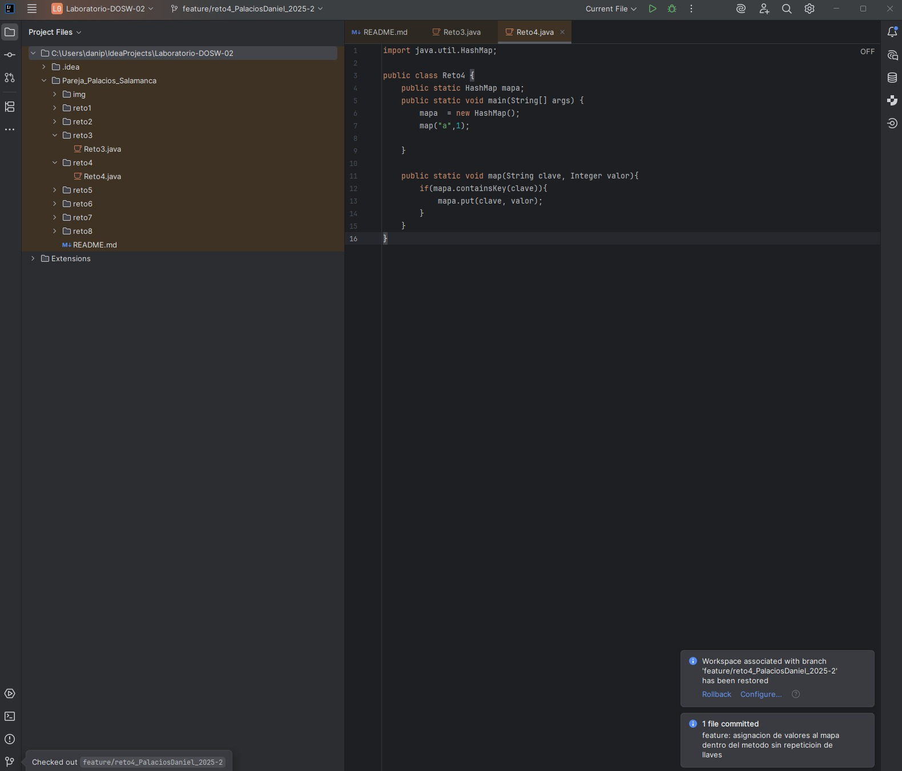
  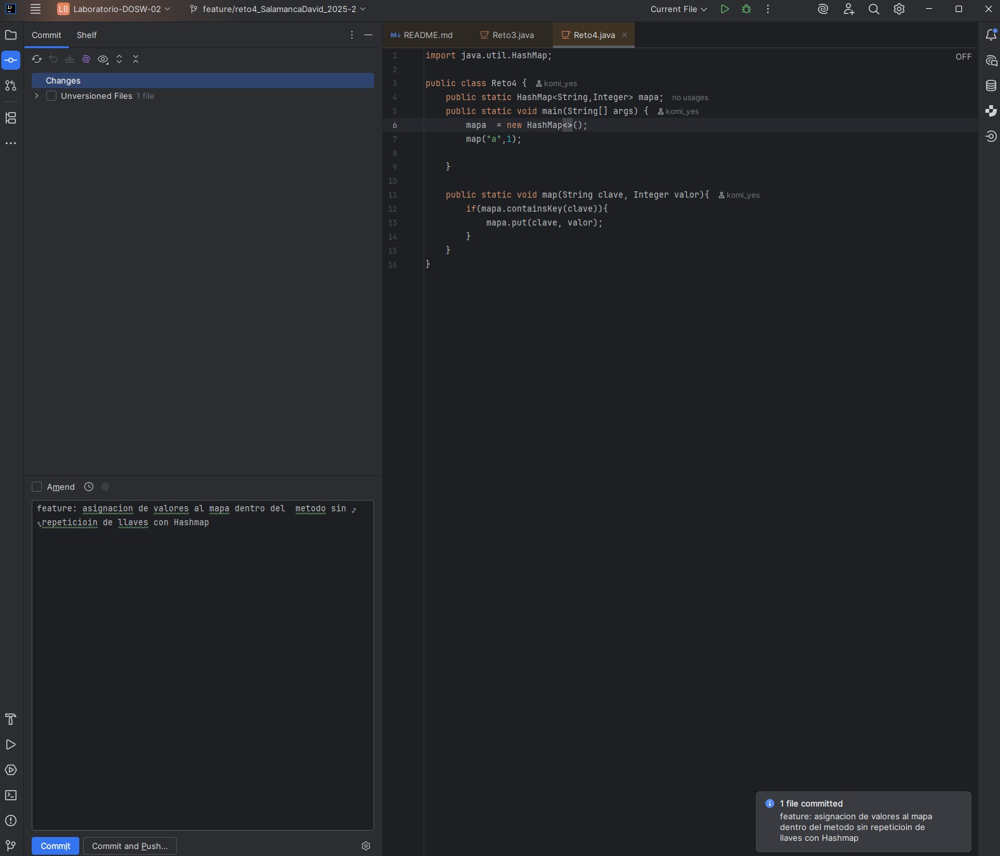

- Implementación actualizada según instrucciones dadas

  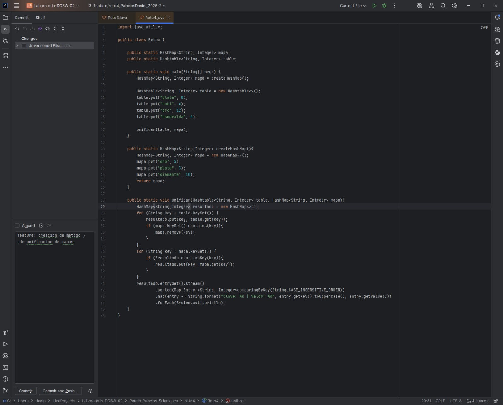
  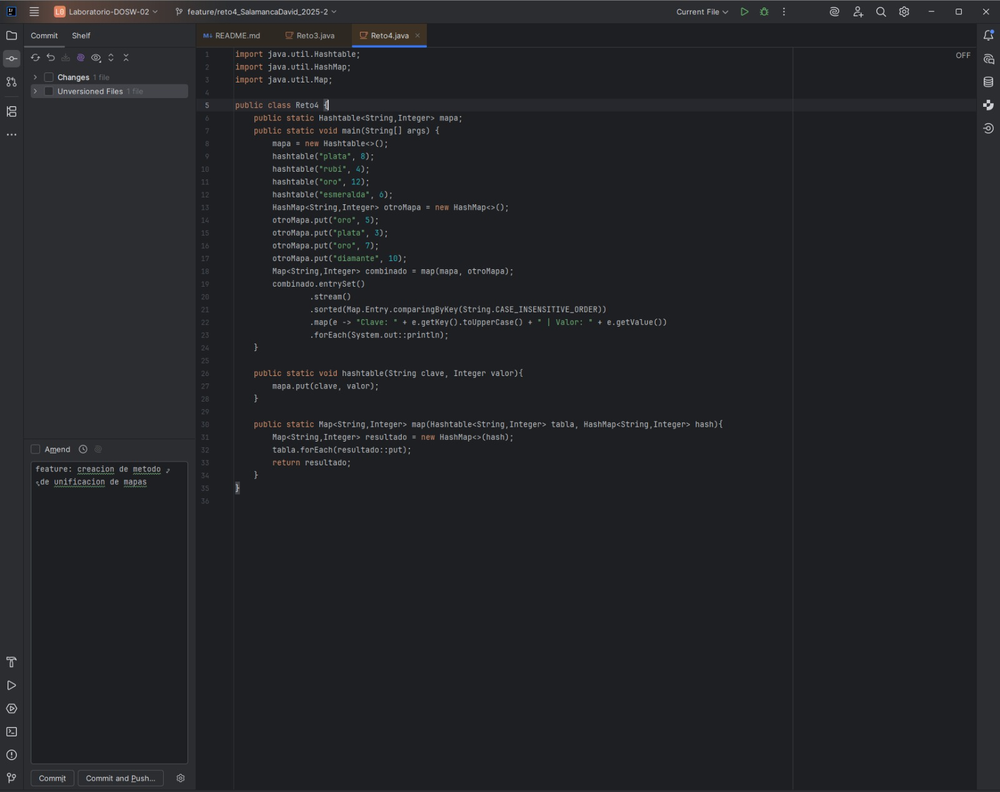

- Implementación completa después de merge

  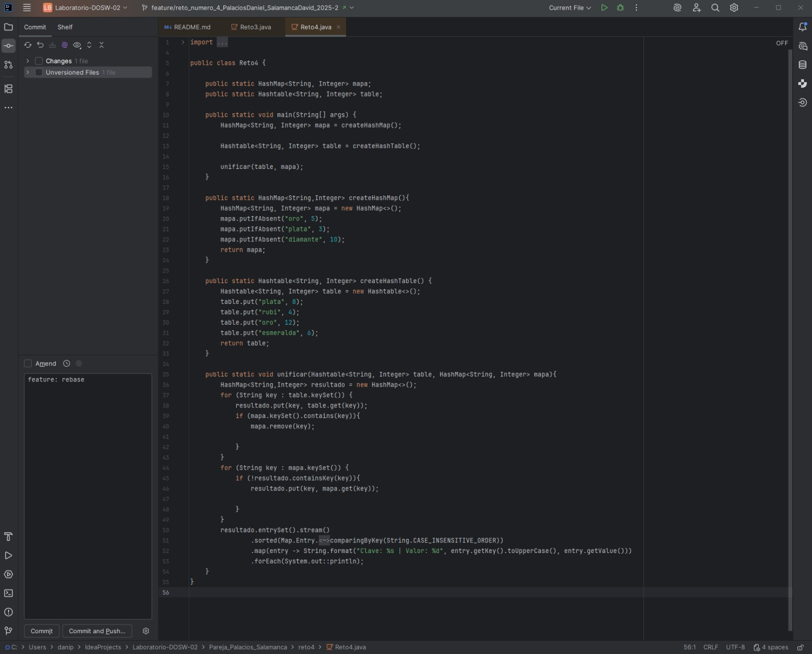

