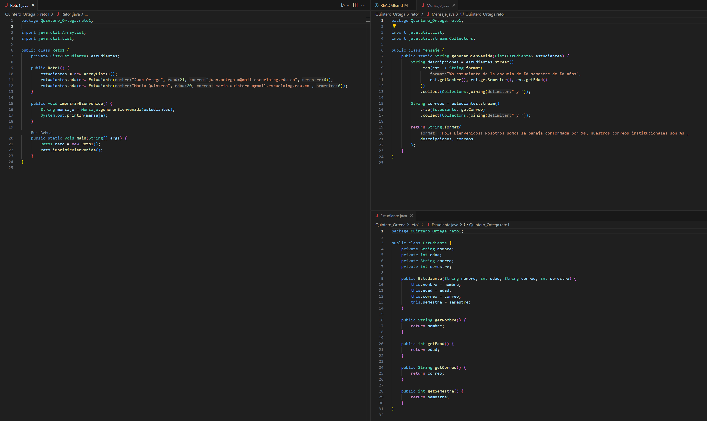
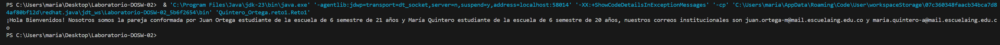

# Laboratorio-DOSW-02

**Integrantes:**
- María Belén Quintero Aldana  
- Juan Sebastián Ortega Muñoz  

**Nombre de la rama:** feature/QuinteroMaria_OrtegaJuan_2025-2  

---

## Retos Completados

### Reto 1: Configuración y creación de rama
**Evidencia:**
  
  

En este reto hicimos uso de las facilidades que brinda los stream() para poder imprimir un mensaje de bienvenida.

---

### Reto 2: Commit colaborativo
**Evidencia:**  
  
Realizamos un commit colaborativo en la misma rama, verificando el log para asegurarnos de que aparecían ambos aportes.  

---

### Reto 3: (nombre del reto)
**Evidencia:**  
  
Descripción breve de lo que hicieron.  

---

### Reto 4: (nombre del reto)
**Evidencia:**  
  
Descripción breve de lo que hicieron.  

---

### Reto 5: (nombre del reto)
**Evidencia:**  
  
Descripción breve de lo que hicieron.  

---

### Reto 6: (nombre del reto)
**Evidencia:**  
  
Descripción breve de lo que hicieron.  

---

### Reto 7: (nombre del reto)
**Evidencia:**  
  
Descripción breve de lo que hicieron.  

---

### Reto 8: (nombre del reto)
**Evidencia:**  
  
Descripción breve de lo que hicieron.  

---

## Preguntas Teóricas
**Pregunta 1. Cuál es la diferencia entre git merge y git rebase**

	El "merge" combina los cambios en las ramas que se deseen. Al hacer "merge" se crea una especie de commit del merge. 
	Por otro lado, el "rebase" se ve como una reescritura que va colocando commits en la rama en la que se esté trabajando. Si se está trabajando en grupo, no es recomendable el uso de "rebase", ya que este es un comando que funciona en proyectos que se lleven de manera más individual.

**Pregunta 2. Si dos ramas modifican la misma línea de un archivo ¿Qué sucede al hacer merge?**

	Git no deja hacer el merge hasta que no se modifique el código manualmente, donde toca escoger que versión se mantiene o si definitivamente toca hacer una nueva.

**Pregunta 3. ¿Cómo puedes ver gráficamente el historial de merges y ramas en consola?**

	Se puede hacer usando el siguiente comando:  git log --oneline --graph --all

**Pregunta 4. Explica la diferencia entre un commit y un push?**

	El commit guarda los cambios en el repositorio local, mientras que el push envía los commits al repositorio remoto.

**Pregunta 5. Para que sirve git stash y git pop?**

	Git stash sirve para guardar los cambios de manera temporal sin hacer commits, mientras que git pop sirve para restaurar los cambios guardados en el repositorio local.

**Pregunta 6. Qué diferencia hay entre HashMap y HashTable?**

	El HashMap no es sincronizado, permite null como clave y como valor, también es más rápido que los HashTable. Estos últimos si están sincronizados, no permiten claves ni valores null.

**Pregunta 7. Qué ventajas tiene Collectors.toMap() frente a un bucle tradicional para llenar un mapa?**

	Es más fácil de leer y escribir, aprovecha a los streams y hace el trabajo más facil ya que usa varios núcleos del procesador al tiempo.
	
**Pregunta 8. Si usas List con objetos y luego aplicas stream().map() que tipo de operación estas haciendo?**

	Una operación de transformación. Convierte cada elemento del stream en otro valor (puede ser del mismo tipo o distinto). Retorna un nuevo Stream con los elementos transformados.

**Pregunta 9. Que hace el método stream().filter() y que retorna?** 

	Aplica un predicado booleano a cada elemento. Mantiene solo los que cumplen la condición. Retorna un Stream con esos elementos filtrados.

**Pregunta 10. Describe el paso a paso de cómo crear una rama desde develop si es una funcionalidad nueva.**

	1. Guardamos o limpiamos el trabajo actual.
		git status
		git add . && git commit -m "WIP" (Solo si tenemos cambios)
	2. Actualizamos las referencias remotas
		git fetch --all
	3. Nos movemos a develop local y traemos lo ultimo
		git checkout develop
		git pull origin develop
	4. Creamos la rama de feature desde develop y nos cambiamos a ella.
		git checkout -b feature/<nombre-corto>
	5. Subimos la rama y establecemos upstream.
		git push -u origin feature/<nombre-corto>

**Pregunta 11. ¿Cuál es la diferencia entre crear una rama con git branch y con git checkout -b?**

git branch <rama>: solo crea la rama. Te quedas en la rama actual.
git checkout -b <rama>: crea y cambia a la nueva rama en un solo paso.

**Pregunta 12. ¿Por qué es recomendable crear ramas feature/ para nuevas funcionalidades en lugar de trabajar en main directamente?**

-Aislamiento: los cambios no rompen el código estable.
-Revisión por PR: código revisado antes de integrar.
-CI segura: pruebas corren en la rama antes de tocar main.
-Historial limpio: commits agrupados por feature.
-Reversión fácil: si algo falla, se revierte la rama o el merge.
-Trabajo en paralelo: varios features sin bloqueos.
-Políticas: proteges main con reglas de branch y evitas pushes accidentales.
