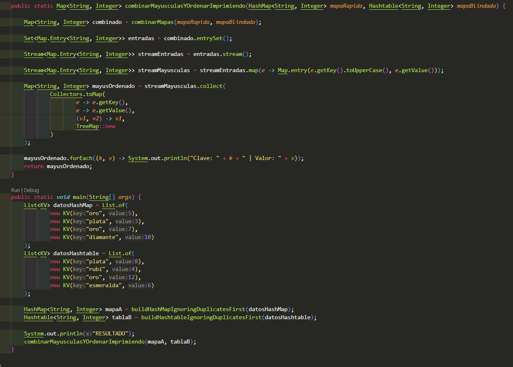
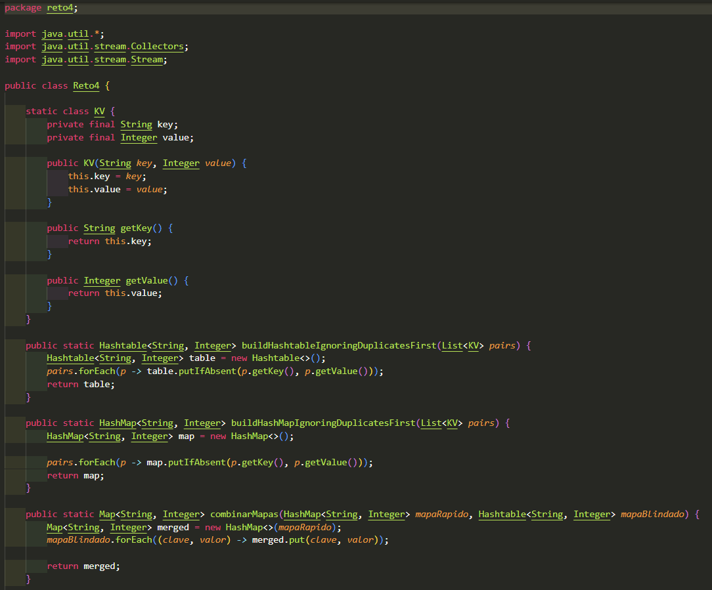
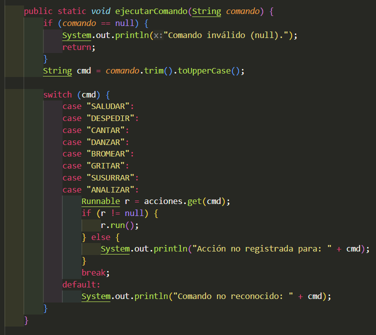
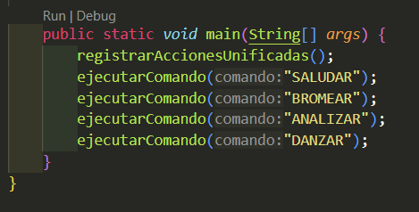

# Maratón Git 2025-2

**Integrantes:**

- Elizabeth Correa 
- Juan Pablo Contreras


**Nombre de la rama:** feature/CorreaElizabeth_ContrerasJuan_2025-2

---

## Retos Completados

### Reto 1: Configuración y creación de rama

### Objetivo
- Crear un mensaje de bienvenida usando **programación funcional** en Java:
  - Estructura de datos: `List<Student>`
  - Operaciones: `stream()`, `map()`, `collect(Collectors.joining())`

### Flujo de ramas
- **Rama del reto:** `feature/CorreaElizabeth_ContrerasJuan_2025-2`.

### Lo que hicimos
- **Modelo `Student`**: nombre, correo, edad, semestre (getters simples).
- **Mensaje `Message.print(List<Student>)`**:
  - Con `stream().map()` formateamos cada estudiante como  
    `"<Nombre> estudiante de la escuela de <Semestre> de <Edad> años"`.
  - Unimos con `Collectors.joining(" y ")` para producir una sola frase.
  - Repetimos el patrón para los **correos** y los unimos con `" y "`.
- **Ejecución en `Main`**:
  - Construimos `List<Student>` con los dos integrantes.
  - Llamamos `new Message().print(estudiantes)` y mostramos el resultado.
  
**Evidencia:**

Output obtenido tras correr el programa

Código: se creó la clase estudiante y la clase mensaje. La clase estudiante tiene los atributos de nombre, edad, correo y semestre. Se hicieron métodos get de cada atributo. La clase mensaje utiliza el stream, map y collect.


# 🏁 Reto #2: Carrera en Paralelo  

En este reto simulamos una carrera de commits donde cada integrante tomó su propio carril de desarrollo (subrama), pero ambos partimos desde la misma línea de salida (la rama `feature/reto2`).  

El objetivo fue **practicar la colaboración en paralelo, resolución de conflictos y uso de expresiones lambda en Java**, mientras íbamos uniendo resultados en un mismo código final.  

---

## 📌 Enunciado  

1. **Estudiante A**  
   - Cambió el nombre del archivo de `Reto2.java` a `CarreraParalela.java`.  
   - Subió la estructura base de la clase al feature del reto (`feature/reto_2_CorreaElizabeth_ContrerasJuan_2025-2`).  

2. **Ambos**  
   - Crearon sus subramas:  
     - `feature/reto2_carril_uno_CorreaElizabeth_ContrerasJuan_2025-2`  
     - `feature/reto2_carril_dos_CorreaElizabeth_ContrerasJuan_2025-2`  

3. **Estudiante B (Carril 1)**  
   - Implementó con **lambda** una función para calcular el **número máximo** de una lista.  

4. **Estudiante A (Carril 2)**  
   - Implementó con **lambda** una función para calcular el **número mínimo** y obtener la cantidad de datos.  

5. **Primer Choque (Merge Conflict)**  
   - Ambos crearon una función con el mismo nombre para procesar la lista.  
   - Se resolvió el conflicto combinando: **mínimo, máximo y cantidad** en un objeto `Resultado`.  

6. **Segunda Vuelta**  
   - Carril 1 añadió si el número mayor era **múltiplo de 2** (if ternario).  
   - Carril 2 añadió si el número mayor era **divisor de 2** (if ternario).  

7. **Tercer Choque**  
   - Carril 1 añadió validación de si la cantidad era **par** (if ternario).  
   - Carril 2 añadió validación de si la cantidad era **impar** (if ternario).  
   - Se resolvió el merge integrando ambas verificaciones.  

8. **Gran Meta (Función Final)**  
   - Se fusionaron todas las funciones en una que recibe **dos listas** y devuelve un objeto `Resultados` con:  
     - Número mayor por lista  
     - Número menor por lista  
     - Cantidad de elementos por lista  
     - Si el mayor es múltiplo/divisor de 2  
     - Si la cantidad es par o impar  

9. Se hizo commit final y merge de las ramas carril a `feature/reto_2__CorreaElizabeth_ContrerasJuan_2025-2`.

## ⚙️ Solución Implementada  
```java

import java.util.Arrays;
import java.util.List;

public class Main {
    public static void main(String[] args) {
    }

    public static int getMax(List<Integer> l) {
        return (l.stream().max(Integer::compare).get());
    }

    private static int amount(List<Integer> l){return (int) l.stream().count();}

    public static List<Integer> getMinAndAmount(List<Integer> l) {
        int min = l.stream().min(Integer::compare).get();
        int count = amount(l);
        return Arrays.asList(min, count);
    }

    public static void crash(List<Integer> l) {
        new Result(getMax(l), getMinAndAmount(l).get(0),getMinAndAmount(l).get(1));
    }

}

class Result {
    private int max;
    private int min;
    private int count;

    public Result(int max, int min, int count) {
        this.max = max;
        this.min = min;
        this.count = count;
    }
}
```
## Reto 3 -- El eco misterioso

En este reto trabajamos en equipo para simular el extraño comportamiento de una cueva que devuelve un eco “especial” según cómo se le hable.

El ejercicio nos permitió practicar:
 - Uso de StringBuilder y StringBuffer.
 - Creación de ramas feature y subramas.
 - Resolución de conflictos en un merge.
 - Uso de lambdas y stream() en Java.

Estudiante A debía crear un método en la rama feature/reto3_builder_Correa_Contreras_2025-2 usando StringBuilder que:
Reciba un mensaje y lo repita 3 veces concatenado con un espacio

Estudiante B debía crear un método en la rama feature/reto3_buffer_Correa_Contreras_2025-2 usando StringBuffer que:
Reciba un mensaje  y Lo invierta

Primer choque (Merge Conflict):
Ambos creamos un método con el mismo nombre, pero con transformaciones diferentes.

El reto consistía en resolver el conflicto de forma correcta creando un método final que:
Recibiera un mensaje, lo repitiera 3 veces con espacios usando StringBuilder y stream(), luego invirtiera el resultado usando StringBuffer, el método debía invocarse con una lambda.

### Lo que hicimos

- **Primero creamos el método que recibiera el mensaje y lo repita 3 veces**
- **Después creamos el método que recibiera el mensaje y lo devolviera en reversa**
- **Por último creamos un método que usara los 2 métodos para retornar el mensaje 3 veces y en reversa.**

#Solución implementada
```java
package reto3;

class Reto3 {
    public static String invertir(String mensaje) {
        return new StringBuffer(mensaje).reverse().chars().mapToObj(c -> (char)c).map(String::valueOf).collect(Collectors.joining());
    }

    public static String repetirTresVeces(String mensaje) {
        return IntStream.range(0, 3).mapToObj(i -> mensaje).reduce(new StringBuilder(), StringBuilder::append, StringBuilder::append).toString();
    }
    public static String repetirEInvertir(String mensaje) {
        return invertir(repetirTresVeces(mensaje));
    }

}
```

## Reto 4 — El tesoro de las Llaves duplicadas

### Objetivo
- Construir un **HashMap** (rápido, sin sincronización) y un **Hashtable** (sincronizado), **ignorando claves duplicadas** (conservar el **primer** valor visto).
- **Combinar** ambos mapas priorizando los valores del **Hashtable** cuando haya conflicto.
- Añadir mejoras:
  - **A**: imprimir claves en **MAYÚSCULAS**.
  - **B**: imprimir en **orden ascendente** por clave.
- Crear una **función final** que haga todo con `Collectors.toMap()`, `stream().map()` y `sorted()`.

### Flujo de ramas 
- **Rama del reto:** `feature/reto_4_CorreaElizabeth_ContrerasJuan_2025-2`
- **Subrama A (HashMap + mayúsculas):** `feature/reto4_hashmap_CorreaElizabeth_ContrerasJuan_2025-2`
- **Subrama B (Hashtable + ordenado):** `feature/reto4_hashtable_CorreaElizabeth_ContrerasJuan_2025-2`


### Lo que hicimos 

- **Inciso A (HashMap)**: desde `List<KV>`, llenar `HashMap` ignorando duplicados con `putIfAbsent` (conserva el **primer** valor).
- **Inciso B (Hashtable)**: igual que A pero en `Hashtable` (sincronizado).
- **Combinar (conflicto planificado)**: `combinarMapas(HashMap, Hashtable)` → copiar el HashMap y luego **pisar** con entradas del Hashtable (prioridad Hashtable).
- **Mejora A**: imprimir claves en MAYÚSCULAS con `stream().map()` + `sorted(...)`.
- **Mejora B**: imprimir **ordenado** por clave con `stream().sorted(...)`.
- **Versión final**: `combineUppercaseAndPrintSorted(...)`  
  1) combinar con prioridad Hashtable,  
  2) pasar claves a MAYÚSCULAS,  
  3) recolectar en TreeMap (orden ascendente),  
  4) imprimir.

**Evidencia:**


- salida de codigo


- evidencia merges


- codigo



# ⚔️ Reto #5: Batalla de Conjuntos  

En esta arena de batalla, los guerreros son números únicos.  
Un equipo lucha sin orden (**HashSet**), y otro en orden natural (**TreeSet**).  

Este reto nos permitió practicar:  

- Uso de **HashSet** y **TreeSet**.  
- Aplicación de **stream().filter()** para filtrar elementos.  
- Uso de **lambda** para imprimir resultados.  
- Resolución de conflictos al unir ramas en Git.  

---

## 📌 Misión  

1. **Estudiante A (HashSet)**  
   - Creó un método en su rama para almacenar números aleatorios sin orden y eliminar los múltiplos de **3**.  

2. **Estudiante B (TreeSet)**  
   - Creó un método en su rama para almacenar números aleatorios en orden ascendente y eliminar los múltiplos de **5**.  

3. **Choque (Merge Conflict)**  
   - Se unieron ambas colecciones en una sola estructura ordenada (**TreeSet**), eliminando duplicados.  
   - Se resolvió el conflicto y se subió la versión final al feature.  

---

## ⚙️ Solución Implementada  

```java
package reto5;

import java.util.*;
import java.util.stream.*;


public class Reto5 {
    public static Set<Integer> almacenarA() {
        HashSet<Integer> numeros = new HashSet<>();
        Random rand = new Random();
        for (int i = 0; i < 20; i++) {
            numeros.add(rand.nextInt(100) + 1);
        }

        System.out.println("Números generados:");
        numeros.forEach(n -> System.out.print(n + " "));

        Set<Integer> filtrados = numeros.stream().filter(n -> n % 3 != 0).collect(Collectors.toSet());

        System.out.println("\n\nNúmeros después de eliminar múltiplos de 3:");
        filtrados.forEach(n -> System.out.print(n + " "));
        return filtrados;
    }

    public static Set<Integer> almacenarB() {
        TreeSet<Integer> numeros = new TreeSet<>();
        Random rand = new Random();

        for (int i = 0; i < 20; i++) {
            numeros.add(rand.nextInt(100) + 1);
        }

        System.out.println("Números generados en orden ascendente:");
        numeros.forEach(n -> System.out.print(n + " "));

        Set<Integer> filtrados = numeros.stream()
                .filter(n -> n % 5 != 0)
                .collect(Collectors.toCollection(TreeSet::new));

        System.out.println("\n\nNúmeros después de eliminar múltiplos de 5:");
        filtrados.forEach(n -> System.out.print(n + " "));
        return filtrados;
    }

    public static void crash(){
        TreeSet<Integer> union = new TreeSet<>();
        Set<Integer> setA = almacenarA();
        Set<Integer> setB = almacenarB();
        union.addAll(setA);
        union.addAll(setB);
        System.out.println("Resultado: ");
        union.forEach(n -> System.out.print("Número en arena: "+ n + " "));
    }
}

```

## Reto 6 — La máquina de decisiones

### Objetivo
- Implementar una **máquina de comandos** que use `switch-case` y un `Map<String, Runnable>` para mapear **comandos** → **acciones** con **lambdas**.
- Registrar **8 comandos** divididos por estudiante y luego **unificarlos**:
  - **A:** `SALUDAR`, `DESPEDIR`, `CANTAR`, `DANZAR`
  - **B:** `BROMEAR`, `GRITAR`, `SUSURRAR`, `ANALIZAR`
- Demostrar el funcionamiento llamando los comandos (ejemplo del enunciado).

### Flujo de ramas
- **Rama del reto:** `feature/reto_6_CorreaElizabeth_ContrerasJuan_2025-2`
- **Subrama A:** `feature/reto6_A_CorreaElizabeth_ContrerasJuan_2025-2`
- **Subrama B:** `feature/reto6_B_CorreaElizabeth_ContrerasJuan_2025-2`

### Lo que hicimos
- **Registro A (lambdas)**: en `registrarAcciones(...)`, se agregaron acciones para `SALUDAR`, `DESPEDIR`, `CANTAR`, `DANZAR`.
- **Registro B (lambdas)**: en **el mismo método y misma firma** (`registrarAcciones(...)`) se agregaron acciones para `BROMEAR`, `GRITAR`, `SUSURRAR`, `ANALIZAR` → **conflicto planificado** al merge.
- **Unificación**: se resolvió el conflicto dejando **una sola función** `registrarAcciones()` con los **8 comandos**.
- **Dispatcher**: `ejecutarComando(String)` usa `switch-case` (8 casos) y ejecuta `acciones.get(cmd).run()` si el comando está registrado; si no, informa.


**Evidencia:**
- salida de código 


- evidencia merges (conflicto/resolución en `registrarAcciones(...)`)  


- codigo




## Cuestionario (Respuestas)

## 1. ¿Cuál es la diferencia entre `git merge` y `git rebase`?

- **git merge**:  
  Combina los cambios de otra rama con la rama actual creando un *commit de merge*.  
  - Mantiene el historial completo de ambas ramas.  
  - Puede resultar en un historial con bifurcaciones (*merge commits*).  
  - Es más seguro porque conserva el contexto original de cada cambio.

- **git rebase**:  
  Toma los cambios de una rama y los aplica sobre otra como si hubieran sido hechos en secuencia.  
  - Reescribe la historia del proyecto.  
  - Elimina los *merge commits* y genera un historial lineal.  
  - Útil para mantener un historial limpio, pero debe usarse con cuidado, sobre todo si la rama ya fue compartida.

---

## 2. Si dos ramas modifican la misma línea de un archivo, ¿qué sucede al hacer merge?

Cuando dos ramas editan la **misma línea** en un archivo, Git no puede decidir cuál cambio conservar.  
Esto genera un **conflicto de merge**.  

- El conflicto debe resolverse manualmente editando el archivo.  
- Git marcará las partes en conflicto con `<<<<<<<`, `=======` y `>>>>>>>`.  

## 3. Ver el historial de merges y ramas en consola

Para visualizar de forma gráfica el historial de **commits, merges y ramas** directamente desde la consola, se puede usar el comando:

```bash
git log --oneline --graph --all --decorate
```

## 4. Explica la diferencia entre un **commit** y un **push**
Un **commit** guarda los cambios en el repositorio **local**, es decir, en tu computadora.  
Un **push** envía esos cambios al repositorio **remoto** (por ejemplo, GitHub), para que otros puedan verlos y usarlos.  

👉 En resumen:  
- **Commit** = guardar cambios localmente.  
- **Push** = subir cambios al servidor remoto.  

---

## 5. ¿Para qué sirve `git stash` y `git pop`?
- **git stash**: Guarda temporalmente los cambios que no has confirmado (commits) para que puedas cambiar de rama o hacer otra acción sin perder tu trabajo.  
- **git stash pop**: Recupera esos cambios guardados y los aplica nuevamente a tu área de trabajo.  
 
1. Estás trabajando en algo pero necesitas cambiar de rama.  
2. Haces `git stash` para guardar tus cambios sin comprometerlos.  
3. Cambias de rama, vuelves a la anterior, y usas `git stash pop` para recuperar lo que estabas haciendo.  

---

## 6. ¿Qué diferencia hay entre **HashMap** y **HashTable**?
- **HashMap**:
  - No es sincronizado → más rápido en entornos de un solo hilo.  
  - Permite **un null** como clave y múltiples valores null.  
  - Introducido en Java 1.2.  

- **HashTable**:
  - Es sincronizado → más seguro en entornos multihilo, pero más lento.  
  - No permite claves null ni valores null.  
  - Es más antiguo (Java 1.0).  

7. **¿Qué ventajas tiene `Collectors.toMap()` frente a un bucle tradicional para llenar un mapa?**  
   - Más **declarativo y conciso** que `for` + `put`.  
   - Permite definir **estrategia de fusión** ante claves duplicadas:  
     ```java
     .collect(Collectors.toMap(kv -> kv.key(), kv -> kv.value(), (v1, v2) -> v1))
     ```
   - Permite elegir la **implementación** del mapa (p. ej., `TreeMap`):  
     ```java
     .collect(Collectors.toMap(KV::key, KV::value, (v1,v2)->v1, TreeMap::new))
     ```
   - Se integra con **pipelines** de streams (map/filter/sorted) y soporta **paralelismo**.

8. **Si usas `List` con objetos y luego aplicas `stream().map()`, ¿qué tipo de operación estás haciendo?**  
   - Es una **operación intermedia de transformación (uno a uno)**.  
   - Toma cada elemento y lo **mapea** a otro (posible **cambio de tipo**).  
   - Retorna un **`Stream<R>`** (se ejecuta al usar una operación terminal).  
     ```java
     List<String> nombres = estudiantes.stream()
         .map(Student::getName) 
         .collect(Collectors.toList());
     ```

9. **¿Qué hace `stream().filter()` y qué retorna?**  
   - Aplica un **predicado** y **retiene** solo los elementos que lo cumplen.  
   - Es **intermedia** y retorna **`Stream<T>`** (perezosa; requiere operación terminal).  
     ```java
     List<Student> mayores = estudiantes.stream()
         .filter(s -> s.getAge() >= 18)
         .collect(Collectors.toList());

10. **Secuencia de pasos para crear una rama desde `develop` (nueva funcionalidad)**

    - Cambiar a `develop` y actualizar
    - Crear y cambiar a la rama de feature
    - Trabajar y confirmar cambios
   -  Publicar la rama y fijar upstream


11. **¿Cuál es la diferencia entre crear una rama con `git branch` y con `git checkout -b`?**  
    - `git branch nombre`: **crea** la rama, pero **no** te mueve a ella.  
      ```bash
      git branch feature/nueva-funcionalidad
      git switch feature/nueva-funcionalidad   
    - `git checkout -b nombre`: **crea y cambia** a la rama en un solo paso.  
      ```bash
      git checkout -b feature/nueva-funcionalidad
      # equivalente moderno:
      git switch -c feature/nueva-funcionalidad
      ```

12. **¿Por qué es recomendable crear ramas `feature/` para nuevas funcionalidades en lugar de trabajar en `main` directamente?**  
    - **Aislamiento**: evitas romper `main` mientras desarrollas.  
    - **Flujo limpio**: facilitas **PRs**, **code review** y **CI/CD** por funcionalidad.  
    - **Historial claro**: commits y merges por tema; mejor trazabilidad.  
    - **Seguridad**: poder **revertir** ó **descartar** una feature sin afectar producción.  
    - **Colaboración**: varias features en paralelo sin bloqueos.  
    - **Norma de equipo**: convención `feature/`, `hotfix/`, `release/` ayuda a la organización.


