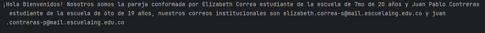
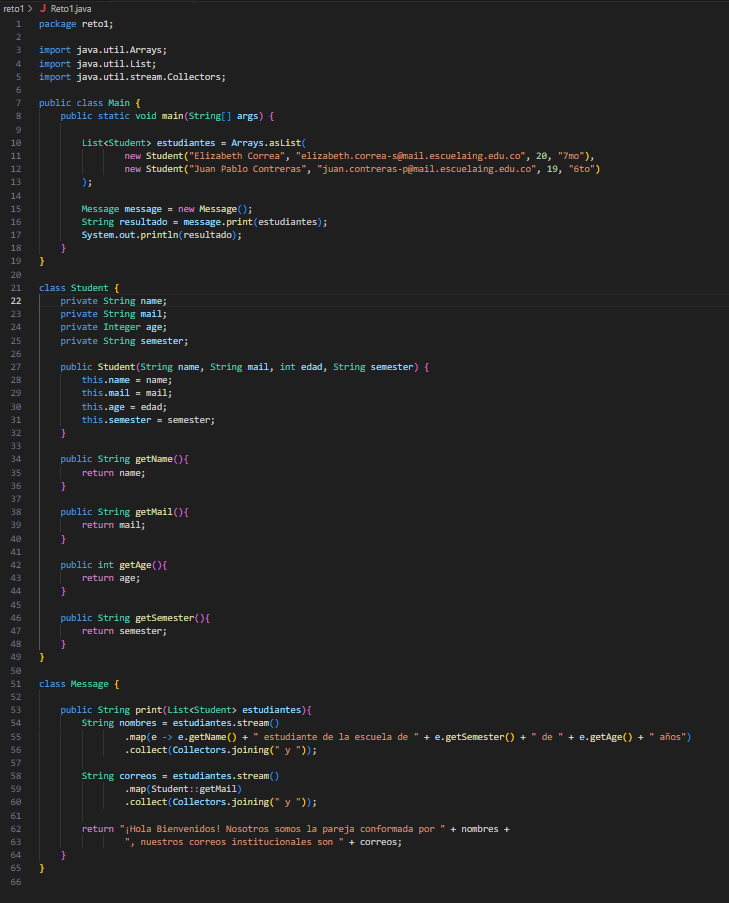
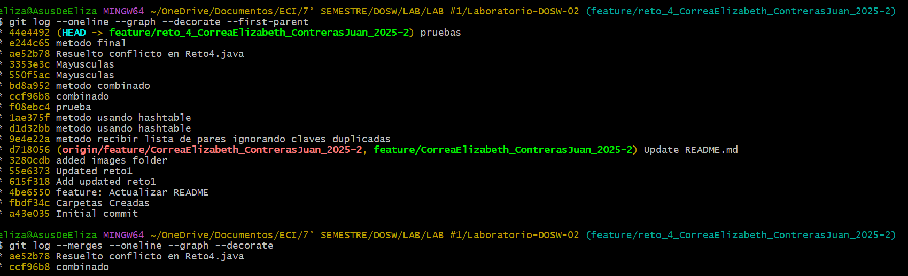
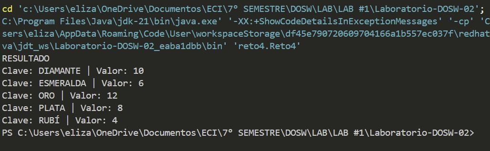
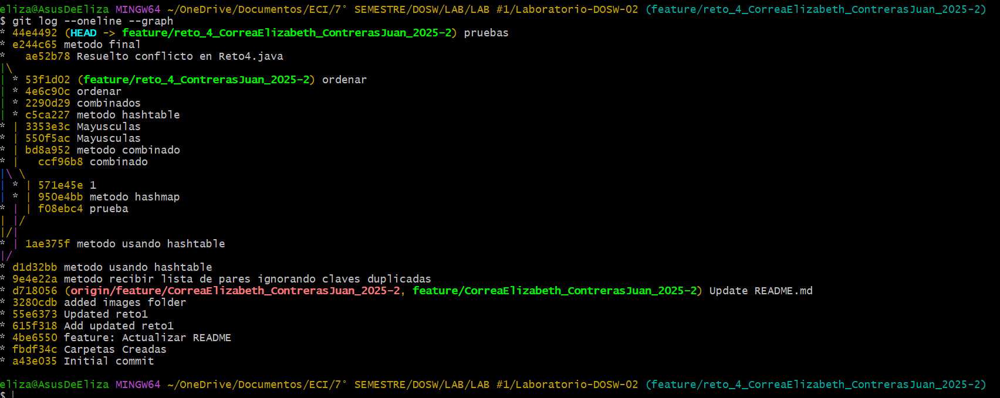
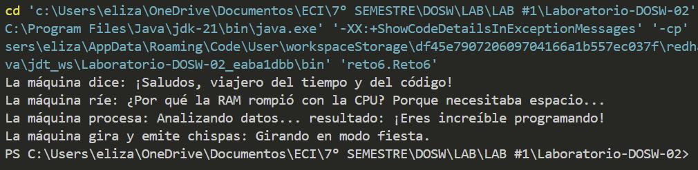
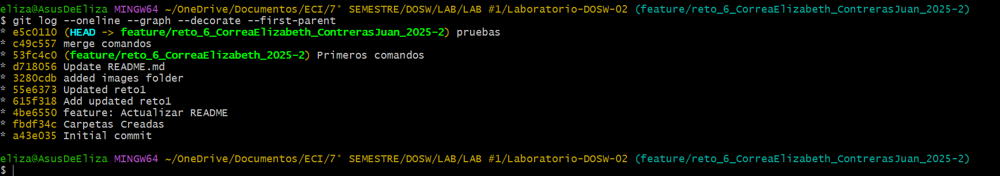

# Maratón Git 2025-2

**Integrantes:**

- Elizabeth Correa 
- Juan Pablo Contreras

**Nombre de la rama:** feature/CorreaElizabeth_ContrerasJuan_2025-2

---

## Retos Completados

### Reto 1: Configuración y creación de rama
**Evidencia:**

Output obtenido tras correr el programa

Código: se creó la clase estudiante y la clase mensaje. La clase estudiante tiene los atributos de nombre, edad, correo y semestre. Se hicieron métodos get de cada atributo. La clase mensaje utiliza el stream, map y collect.

## Reto 3 -- El eco misterioso

En este reto trabajamos en equipo para simular el extraño comportamiento de una cueva que devuelve un eco “especial” según cómo se le hable.

El ejercicio nos permitió practicar:
 - Uso de StringBuilder y StringBuffer.
 - Creación de ramas feature y subramas.
 - Resolución de conflictos en un merge.
 - Uso de lambdas y stream() en Java.
---

## Reto 4 — El tesoro de las Llaves duplicadas

### Objetivo
- Construir un **HashMap** (rápido, sin sincronización) y un **Hashtable** (sincronizado), **ignorando claves duplicadas** (conservar el **primer** valor visto).
- **Combinar** ambos mapas priorizando los valores del **Hashtable** cuando haya conflicto.
- Añadir mejoras:
  - **A**: imprimir claves en **MAYÚSCULAS**.
  - **B**: imprimir en **orden ascendente** por clave.
- Crear una **función final** que haga todo con `Collectors.toMap()`, `stream().map()` y `sorted()`.

### Flujo de ramas 
- **Rama del reto:** `feature/reto_4_CorreaElizabeth_ContrerasJuan_2025-2`
- **Subrama A (HashMap + mayúsculas):** `feature/reto4_hashmap_CorreaElizabeth_ContrerasJuan_2025-2`
- **Subrama B (Hashtable + ordenado):** `feature/reto4_hashtable_CorreaElizabeth_ContrerasJuan_2025-2`

### Lo que hicimos 

- **Inciso A (HashMap)**: desde `List<KV>`, llenar `HashMap` ignorando duplicados con `putIfAbsent` (conserva el **primer** valor).
- **Inciso B (Hashtable)**: igual que A pero en `Hashtable` (sincronizado).
- **Combinar (conflicto planificado)**: `combinarMapas(HashMap, Hashtable)` → copiar el HashMap y luego **pisar** con entradas del Hashtable (prioridad Hashtable).
- **Mejora A**: imprimir claves en MAYÚSCULAS con `stream().map()` + `sorted(...)`.
- **Mejora B**: imprimir **ordenado** por clave con `stream().sorted(...)`.
- **Versión final**: `combineUppercaseAndPrintSorted(...)`  
  1) combinar con prioridad Hashtable,  
  2) pasar claves a MAYÚSCULAS,  
  3) recolectar en TreeMap (orden ascendente),  
  4) imprimir.

**Evidencia:**

- salida de codigo

- evidencia merges

## Reto 6 — La máquina de decisiones

### Objetivo
- Implementar una **máquina de comandos** que use `switch-case` y un `Map<String, Runnable>` para mapear **comandos** → **acciones** con **lambdas**.
- Registrar **8 comandos** divididos por estudiante y luego **unificarlos**:
  - **A:** `SALUDAR`, `DESPEDIR`, `CANTAR`, `DANZAR`
  - **B:** `BROMEAR`, `GRITAR`, `SUSURRAR`, `ANALIZAR`
- Demostrar el funcionamiento llamando los comandos (ejemplo del enunciado).

### Flujo de ramas
- **Rama del reto:** `feature/reto_6_CorreaElizabeth_ContrerasJuan_2025-2`
- **Subrama A:** `feature/reto6_A_CorreaElizabeth_ContrerasJuan_2025-2`
- **Subrama B:** `feature/reto6_B_CorreaElizabeth_ContrerasJuan_2025-2`

### Lo que hicimos
- **Registro A (lambdas)**: en `registrarAcciones(...)`, se agregaron acciones para `SALUDAR`, `DESPEDIR`, `CANTAR`, `DANZAR`.
- **Registro B (lambdas)**: en **el mismo método y misma firma** (`registrarAcciones(...)`) se agregaron acciones para `BROMEAR`, `GRITAR`, `SUSURRAR`, `ANALIZAR` → **conflicto planificado** al merge.
- **Unificación**: se resolvió el conflicto dejando **una sola función** `registrarAcciones()` con los **8 comandos**.
- **Dispatcher**: `ejecutarComando(String)` usa `switch-case` (8 casos) y ejecuta `acciones.get(cmd).run()` si el comando está registrado; si no, informa.

**Evidencia:**
- salida de código 

- evidencia merges (conflicto/resolución en `registrarAcciones(...)`)  

