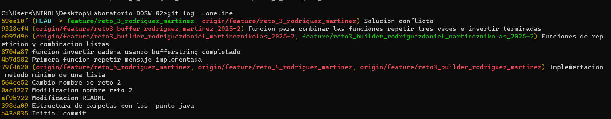

# Maraton Git 2025-2

**Integrantes**
- Nikolas Martinez Rivera
- Daniel Alejandro Rodriguez Baracaldo

**Nombre de la rama>** feature/PalaciosDaniel_SalamancaDavid_2025-2

---

## Retos completados

###  Reto 1: Configuración y creacion de rama

### RETO #2: Carrera en Paralelo
**Evidencia**

Cada integrante realizó las funciones respectivas a su carril (ramas hijas) para luego combinarlas en la raiz 
principal, ocurrieron los choques esperados a los cuales dimos solución, con esto unificamos la 
estructura de la rama para que fuera una.