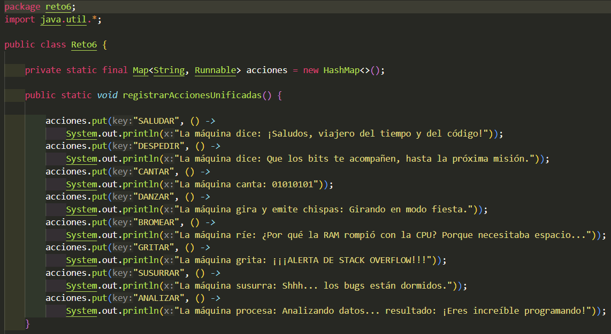

# Maratón Git 2025-2

**Integrantes:**

- Elizabeth Correa 
- Juan Pablo Contreras


**Nombre de la rama:** feature/CorreaElizabeth_ContrerasJuan_2025-2

---

## Retos Completados

### Reto 1: Configuración y creación de rama

### Objetivo
- Crear un mensaje de bienvenida usando **programación funcional** en Java:
  - Estructura de datos: `List<Student>`
  - Operaciones: `stream()`, `map()`, `collect(Collectors.joining())`

### Flujo de ramas
- **Rama del reto:** `feature/CorreaElizabeth_ContrerasJuan_2025-2`.

### Lo que hicimos
- **Modelo `Student`**: nombre, correo, edad, semestre (getters simples).
- **Mensaje `Message.print(List<Student>)`**:
  - Con `stream().map()` formateamos cada estudiante como  
    `"<Nombre> estudiante de la escuela de <Semestre> de <Edad> años"`.
  - Unimos con `Collectors.joining(" y ")` para producir una sola frase.
  - Repetimos el patrón para los **correos** y los unimos con `" y "`.
- **Ejecución en `Main`**:
  - Construimos `List<Student>` con los dos integrantes.
  - Llamamos `new Message().print(estudiantes)` y mostramos el resultado.
  
**Evidencia:**

Output obtenido tras correr el programa

Código: se creó la clase estudiante y la clase mensaje. La clase estudiante tiene los atributos de nombre, edad, correo y semestre. Se hicieron métodos get de cada atributo. La clase mensaje utiliza el stream, map y collect.

## Reto 3 -- El eco misterioso

En este reto trabajamos en equipo para simular el extraño comportamiento de una cueva que devuelve un eco “especial” según cómo se le hable.

El ejercicio nos permitió practicar:
 - Uso de StringBuilder y StringBuffer.
 - Creación de ramas feature y subramas.
 - Resolución de conflictos en un merge.
 - Uso de lambdas y stream() en Java.
---

## Reto 4 — El tesoro de las Llaves duplicadas

### Objetivo
- Construir un **HashMap** (rápido, sin sincronización) y un **Hashtable** (sincronizado), **ignorando claves duplicadas** (conservar el **primer** valor visto).
- **Combinar** ambos mapas priorizando los valores del **Hashtable** cuando haya conflicto.
- Añadir mejoras:
  - **A**: imprimir claves en **MAYÚSCULAS**.
  - **B**: imprimir en **orden ascendente** por clave.
- Crear una **función final** que haga todo con `Collectors.toMap()`, `stream().map()` y `sorted()`.

### Flujo de ramas 
- **Rama del reto:** `feature/reto_4_CorreaElizabeth_ContrerasJuan_2025-2`
- **Subrama A (HashMap + mayúsculas):** `feature/reto4_hashmap_CorreaElizabeth_ContrerasJuan_2025-2`
- **Subrama B (Hashtable + ordenado):** `feature/reto4_hashtable_CorreaElizabeth_ContrerasJuan_2025-2`


### Lo que hicimos 

- **Inciso A (HashMap)**: desde `List<KV>`, llenar `HashMap` ignorando duplicados con `putIfAbsent` (conserva el **primer** valor).
- **Inciso B (Hashtable)**: igual que A pero en `Hashtable` (sincronizado).
- **Combinar (conflicto planificado)**: `combinarMapas(HashMap, Hashtable)` → copiar el HashMap y luego **pisar** con entradas del Hashtable (prioridad Hashtable).
- **Mejora A**: imprimir claves en MAYÚSCULAS con `stream().map()` + `sorted(...)`.
- **Mejora B**: imprimir **ordenado** por clave con `stream().sorted(...)`.
- **Versión final**: `combineUppercaseAndPrintSorted(...)`  
  1) combinar con prioridad Hashtable,  
  2) pasar claves a MAYÚSCULAS,  
  3) recolectar en TreeMap (orden ascendente),  
  4) imprimir.

**Evidencia:**


- salida de codigo


- evidencia merges


- codigo


## Reto 6 — La máquina de decisiones

### Objetivo
- Implementar una **máquina de comandos** que use `switch-case` y un `Map<String, Runnable>` para mapear **comandos** → **acciones** con **lambdas**.
- Registrar **8 comandos** divididos por estudiante y luego **unificarlos**:
  - **A:** `SALUDAR`, `DESPEDIR`, `CANTAR`, `DANZAR`
  - **B:** `BROMEAR`, `GRITAR`, `SUSURRAR`, `ANALIZAR`
- Demostrar el funcionamiento llamando los comandos (ejemplo del enunciado).

### Flujo de ramas
- **Rama del reto:** `feature/reto_6_CorreaElizabeth_ContrerasJuan_2025-2`
- **Subrama A:** `feature/reto6_A_CorreaElizabeth_ContrerasJuan_2025-2`
- **Subrama B:** `feature/reto6_B_CorreaElizabeth_ContrerasJuan_2025-2`

### Lo que hicimos
- **Registro A (lambdas)**: en `registrarAcciones(...)`, se agregaron acciones para `SALUDAR`, `DESPEDIR`, `CANTAR`, `DANZAR`.
- **Registro B (lambdas)**: en **el mismo método y misma firma** (`registrarAcciones(...)`) se agregaron acciones para `BROMEAR`, `GRITAR`, `SUSURRAR`, `ANALIZAR` → **conflicto planificado** al merge.
- **Unificación**: se resolvió el conflicto dejando **una sola función** `registrarAcciones()` con los **8 comandos**.
- **Dispatcher**: `ejecutarComando(String)` usa `switch-case` (8 casos) y ejecuta `acciones.get(cmd).run()` si el comando está registrado; si no, informa.


**Evidencia:**
- salida de código 


- evidencia merges (conflicto/resolución en `registrarAcciones(...)`)  


- codigo



## Cuestionario (Respuestas)

7. **¿Qué ventajas tiene `Collectors.toMap()` frente a un bucle tradicional para llenar un mapa?**  
   - Más **declarativo y conciso** que `for` + `put`.  
   - Permite definir **estrategia de fusión** ante claves duplicadas:  
     ```java
     .collect(Collectors.toMap(kv -> kv.key(), kv -> kv.value(), (v1, v2) -> v1))
     ```
   - Permite elegir la **implementación** del mapa (p. ej., `TreeMap`):  
     ```java
     .collect(Collectors.toMap(KV::key, KV::value, (v1,v2)->v1, TreeMap::new))
     ```
   - Se integra con **pipelines** de streams (map/filter/sorted) y soporta **paralelismo**.

8. **Si usas `List` con objetos y luego aplicas `stream().map()`, ¿qué tipo de operación estás haciendo?**  
   - Es una **operación intermedia de transformación (uno a uno)**.  
   - Toma cada elemento y lo **mapea** a otro (posible **cambio de tipo**).  
   - Retorna un **`Stream<R>`** (se ejecuta al usar una operación terminal).  
     ```java
     List<String> nombres = estudiantes.stream()
         .map(Student::getName) 
         .collect(Collectors.toList());
     ```

9. **¿Qué hace `stream().filter()` y qué retorna?**  
   - Aplica un **predicado** y **retiene** solo los elementos que lo cumplen.  
   - Es **intermedia** y retorna **`Stream<T>`** (perezosa; requiere operación terminal).  
     ```java
     List<Student> mayores = estudiantes.stream()
         .filter(s -> s.getAge() >= 18)
         .collect(Collectors.toList());

10. **Secuencia de pasos para crear una rama desde `develop` (nueva funcionalidad)**

    - Cambiar a `develop` y actualizar
    - Crear y cambiar a la rama de feature
    - Trabajar y confirmar cambios
   -  Publicar la rama y fijar upstream


11. **¿Cuál es la diferencia entre crear una rama con `git branch` y con `git checkout -b`?**  
    - `git branch nombre`: **crea** la rama, pero **no** te mueve a ella.  
      ```bash
      git branch feature/nueva-funcionalidad
      git switch feature/nueva-funcionalidad   
    - `git checkout -b nombre`: **crea y cambia** a la rama en un solo paso.  
      ```bash
      git checkout -b feature/nueva-funcionalidad
      # equivalente moderno:
      git switch -c feature/nueva-funcionalidad
      ```

12. **¿Por qué es recomendable crear ramas `feature/` para nuevas funcionalidades en lugar de trabajar en `main` directamente?**  
    - **Aislamiento**: evitas romper `main` mientras desarrollas.  
    - **Flujo limpio**: facilitas **PRs**, **code review** y **CI/CD** por funcionalidad.  
    - **Historial claro**: commits y merges por tema; mejor trazabilidad.  
    - **Seguridad**: poder **revertir** ó **descartar** una feature sin afectar producción.  
    - **Colaboración**: varias features en paralelo sin bloqueos.  
    - **Norma de equipo**: convención `feature/`, `hotfix/`, `release/` ayuda a la organización.


